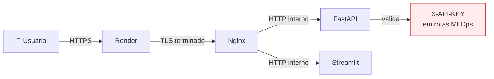
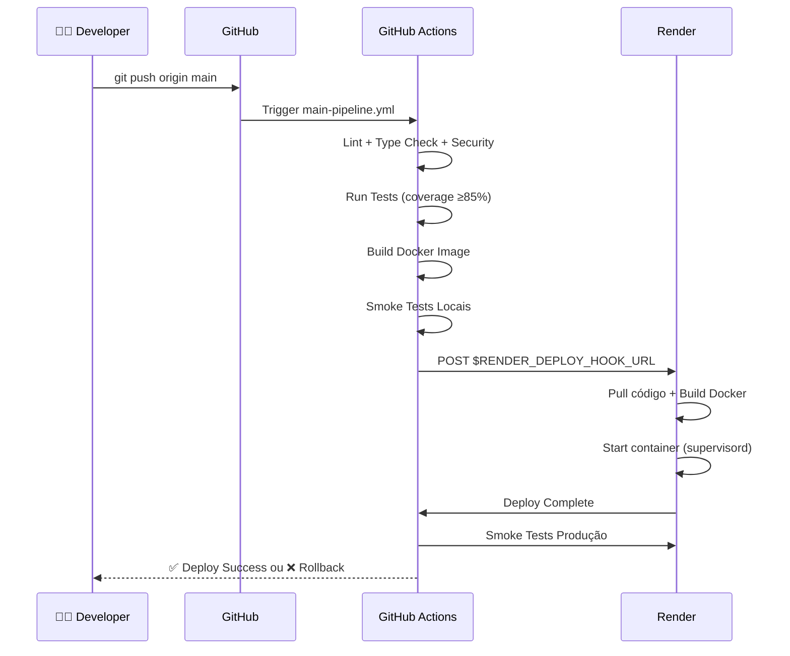

# Guia Completo de Deploy e Operações

> Guia técnico detalhado para deploy, configuração, monitoramento e troubleshooting da aplicação em produção (Render + Docker).

---

## 📋 Índice

- [1. Visão Geral da Arquitetura](#1-visão-geral-da-arquitetura)
- [2. Pré-requisitos](#2-pré-requisitos)
- [3. Infraestrutura como Código (IaC)](#3-infraestrutura-como-código-iac)
- [4. Variáveis de Ambiente](#4-variáveis-de-ambiente)
- [5. Processo de Deploy](#5-processo-de-deploy)
- [6. Validação Pós-Deploy](#6-validação-pós-deploy)
- [7. Rollback e Recuperação](#7-rollback-e-recuperação)
- [8. Monitoramento](#8-monitoramento)
- [9. Troubleshooting](#9-troubleshooting)

---

## 1. Visão Geral da Arquitetura

### 🏗️ Stack de Produção

```mermaid
graph TB
    Internet[🌐 Internet] --> Render[Render Cloud]
    Render --> Docker[🐳 Container Docker]
    Docker --> Nginx[Nginx :8080]
    
    Nginx --> Landing[/ Landing Page]
    Nginx --> API[/api/* FastAPI :8000]
    Nginx --> Dashboard[/dashboard/* Streamlit :8501]
    
    Supervisor[Supervisord] -.manages.- API
    Supervisor -.manages.- Dashboard
    Supervisor -.manages.- KeepAlive[Keep-Alive Script]
    
    API --> Model[(Model Loader)]
    Dashboard --> API
    
    classDef cloud fill:#e3f2fd,stroke:#1976d2
    classDef container fill:#fff3e0,stroke:#f57c00
    classDef service fill:#e8f5e9,stroke:#388e3c
    
    class Render cloud
    class Docker,Supervisor container
    class Nginx,API,Dashboard,Landing service
```

### 📦 Componentes e Responsabilidades

| Componente | Porta | Propósito | Gerenciado por |
|------------|-------|-----------|----------------|
| **Nginx** | 8080 | Reverse proxy, servir assets estáticos | Render |
| **FastAPI** | 8000 (interno) | API REST com ML serving | Supervisord |
| **Streamlit** | 8501 (interno) | Dashboard interativo | Supervisord |
| **Supervisord** | - | Process manager (inicia/monitora serviços) | Docker ENTRYPOINT |
| **Keep-Alive** | - | Script para evitar cold starts | Supervisord |

### 🌐 Rotas Públicas

| Rota | Backend | Descrição |
|------|---------|-----------|
| `/` | Nginx (index.html) | Landing page HTML estática |
| `/api/*` | FastAPI (:8000) | API REST com Swagger em `/api/docs` |
| `/dashboard/*` | Streamlit (:8501) | Dashboard interativo de predições |
| `/health` | Nginx | Health check (status 200) |

### 🔒 Estratégia de Segurança



**Rotas protegidas (requerem `X-API-KEY`):**
- `POST /api/retrain` - Retreinar modelo challenger
- `POST /api/promote` - Promover challenger → champion
- `POST /api/discard` - Descartar challenger

---

## 2. Pré-requisitos

### ✅ Requisitos no Render

1. **Conta Render** (plano gratuito ou pago)
2. **Repositório GitHub** conectado ao Render
3. **Arquivo `render.yaml`** versionado na raiz do repositório

4. **Secret configurado no GitHub:**
   - `RENDER_DEPLOY_HOOK_URL`: Webhook para trigger de deploy automático
   - Configurar em: **GitHub Repo → Settings → Secrets and Variables → Actions**

### 📝 Configuração Inicial do Serviço

**No painel do Render:**

1. **Create New → Web Service**
2. **Connect repository** (escolher o repositório do projeto)
3. **Configurar serviço:**
   ```
   Name:           fase-5-datathon (ou nome de sua escolha)
   Environment:    Docker
   Region:         Oregon (US West) ou mais próximo do Brasil
   Branch:         main
   Dockerfile:     Dockerfile
   ```

4. **Advanced → Environment Variables:** (ver seção 4)

---

## 3. Infraestrutura como Código (IaC)

### 📜 render.yaml como Fonte de Verdade

O projeto adota `render.yaml` como **contrato IaC** da infraestrutura.

**Com Blueprint habilitado (planos pagos):**
- Serviço gerenciado declarativamente a partir do `render.yaml`
- Mudanças no YAML são aplicadas automaticamente no próximo deploy

**Sem Blueprint (plano gratuito / serviço legado):**
- `render.yaml` permanece como **referência de configuração**
- Variáveis devem ser configuradas manualmente em **Service → Environment**
- **Importante:** manter paridade entre YAML e configuração manual

### 🔍 Estrutura do render.yaml

```yaml
services:
  - type: web
    name: fase-5-api
    env: docker
    dockerfilePath: ./Dockerfile
    plan: free  # ou starter/standard
    
    envVars:
      - key: ENVIRONMENT
        value: production
      - key: API_URL
        value: https://fase-5-datathon.onrender.com/api
      - key: MODEL_PATH
        value: app/models/model.pkl
      - key: DATASET_PATH
        value: app/data/raw/BASE DE DADOS PEDE 2024 - DATATHON.xlsx
      - key: ARTIFACTS_DIR
        value: app/artifacts
      - key: KEEP_ALIVE_INTERVAL
        value: 600
      - key: MLFLOW_TRACKING_URI
        value: file:./mlruns
      - key: API_KEY
        sync: false  # Secret gerenciado no painel
```

### ⚠️ Drift de Configuração

**Sintoma:** Aplicação funciona localmente mas falha em produção.

**Causa comum:** Variável configurada no `.env.example` mas ausente no Render.

**Solução:**
1. Compare **Service → Environment** com `render.yaml`
2. Adicione variáveis ausentes manualmente
3. Redeploy via **Manual Deploy → Clear build cache & deploy**

---

## 4. Variáveis de Ambiente

### 🔧 Variáveis Operacionais (não sensíveis)

| Variável | Valor de Produção | Descrição |
|----------|-------------------|-----------|
| `ENVIRONMENT` | `production` | Define ambiente de execução |
| `API_URL` | `https://SEU_APP.onrender.com/api` | URL base da API (para dashboard) |
| `MODEL_PATH` | `app/models/model.pkl` | Caminho do modelo champion |
| `DATASET_PATH` | `app/data/raw/BASE DE DADOS...xlsx` | Caminho do dataset de treino |
| `ARTIFACTS_DIR` | `app/artifacts` | Diretório de artifacts do MLflow |
| `KEEP_ALIVE_INTERVAL` | `600` | Intervalo (s) de keep-alive para evitar cold start |
| `MLFLOW_TRACKING_URI` | `file:./mlruns` | URI do MLflow (local em produção free tier) |
| `PORT` | `8080` | Porta exposta pelo Render (gerenciada automaticamente) |

### 🔐 Segredos (sensíveis)

| Variável | Como Configurar | Uso |
|----------|-----------------|-----|
| `API_KEY` | Render Dashboard → Environment | Proteger rotas MLOps (`/retrain`, `/promote`, `/discard`) |

**⚠️ Nunca versionar:**
- Arquivo `.env` real (apenas `.env.example`)
- Valores de `API_KEY`
- Credenciais de bancos/APIs externas

### 📝 Como Adicionar Variável Nova

**1. Local (desenvolvimento):**
```bash
# .env
API_KEY=sua-chave-local-dev
ENVIRONMENT=development
```

**2. Documentar no `.env.example`:**
```bash
# .env.example
API_KEY=your-secret-api-key-here
ENVIRONMENT=production
```

**3. Atualizar `render.yaml`:**
```yaml
envVars:
  - key: API_KEY
    sync: false  # Indica secret gerenciado manualmente
```

**4. Configurar no Render:**
- **Service → Environment → Add Environment Variable**
- Nome: `API_KEY`
- Valor: `<seu-secret-real>`
- Save changes → Trigger deploy

---

## 5. Processo de Deploy

### 🚀 Fluxo Completo (GitOps)



### 📋 Estágios do Deploy

**1. Validação Local (Developer):**
```bash
make quality  # lint + type + security
make test     # testes com coverage
docker build -f Dockerfile -t fase-5:local .
```

**2. CI/CD (GitHub Actions):**
```yaml
# .github/workflows/main-pipeline.yml
steps:
  - Quality checks (ruff, mypy, bandit)
  - Tests (pytest ≥85% coverage)
  - Build Docker image
  - Smoke tests locais
  - Trigger Render deploy hook
```

**3. Build Remoto (Render):**
```bash
# Render executa automaticamente:
docker build -f Dockerfile -t <service> .
docker run -p 8080:8080 <service>
```

**4. Smoke Tests Pós-Deploy:**
```bash
# CI valida endpoints após deploy
curl https://SEU_APP.onrender.com/health
curl https://SEU_APP.onrender.com/api/docs
pytest tests/smoke/ --url=https://SEU_APP.onrender.com
```

### ⏱️ Tempos Esperados

| Estágio | Duração Esperada |
|---------|------------------|
| Quality checks | 1-2 min |
| Tests locais | 1-2 min |
| Build Docker | 3-5 min |
| Deploy Render | 2-4 min |
| Smoke tests | 30s-1min |
| **Total** | **8-14 min** |

### 🔄 Deploy Manual (quando necessário)

**No painel do Render:**

1. **Service → Manual Deploy**
2. **Opções:**
   - `Deploy latest commit` - deploya HEAD da branch configurada
   - `Clear build cache & deploy` - rebuild completo (usar se build está com cache corrompido)
3. **Acompanhar logs** em real-time na aba **Logs**

---

## 6. Validação Pós-Deploy

### ✅ Checklist de Validação

**1. Health Check:**
```bash
# Deve retornar status 200
curl -fsSL https://SEU_APP.onrender.com/health

# Output esperado:
# {"status":"healthy","timestamp":"2024-12-20T10:30:00Z"}
```

**2. API Endpoints:**
```bash
# Swagger UI deve carregar
curl -fsSL https://SEU_APP.onrender.com/api/docs > /dev/null && echo "✅ API OK"

# Informações do modelo
curl https://SEU_APP.onrender.com/api/model/info

# Output esperado:
# {
#   "model_type": "RandomForestClassifier",
#   "run_id": "abc123...",
#   "created_at": "2024-12-15T14:20:00Z",
#   ...
# }
```

**3. Dashboard:**
```bash
# Dashboard deve carregar e conter texto esperado
curl https://SEU_APP.onrender.com/dashboard/ | grep "Painel de Predições"

# ✅ Output esperado: linha com texto "Painel de Predições"
```

**4. Predições End-to-End:**
```bash
# Teste de predição completo
curl -X POST https://SEU_APP.onrender.com/api/predict \
  -H "Content-Type: application/json" \
  -d '{
    "IDADE": 12,
    "NOTA_PORT": 7.5,
    "NOTA_MAT": 8.0,
    "NOTA_ING": 6.5,
    "INDE": 5.8,
    "IAA": 5.5,
    "IEG": 6.0,
    "IPS": 5.9,
    "IDA": 6.2,
    "IPP": 5.7,
    "IPV": 6.1,
    "IAN": 5.6
  }'

# Output esperado:
# {
#   "probabilidade_ponto_virada": 0.72,
#   "ponto_virada": true,
#   "confianca": "alta",
#   ...
# }
```

### 🔍 Smoke Tests Automatizados

```bash
# Executar suite completa de smoke tests
pytest tests/smoke/ --url=https://SEU_APP.onrender.com -v

# Testes incluídos:
# - test_landing_page_loads
# - test_api_health_endpoint
# - test_api_docs_accessible
# - test_dashboard_loads
# - test_model_info_endpoint
# - test_prediction_endpoint_basic
```

---

## 7. Rollback e Recuperação

### 🔄 Estratégia GitOps-Only

**⚠️ IMPORTANTE:** Rollback é **exclusivamente via Git**. Nunca corrigir produção manualmente fora da esteira.

### 📋 Procedimentos de Rollback

**Opção 1: Via Issue Label `ops:rollback` (Recomendado):**

```bash
# 1. No GitHub Issues, criar nova issue:
#    Título: "Rollback para commit abc123"
#    Label: ops:rollback
#    
# 2. Workflow .github/workflows/issue-ops-rollback.yml executa automaticamente:
#    - Identifica commit-alvo
#    - Cria branch de rollback
#    - Reverte commit problemático
#    - Abre PR para main
#    
# 3. Revisar e aprovar PR
# 4. Merge aciona deploy automático
```

**Opção 2: Git Revert Manual:**

```bash
# 1. Identificar commit problemático
git log --oneline -10

# Exemplo output:
# abc123d (HEAD -> main) feat: nova funcionalidade problemática
# def456e refactor: código estável
# ghi789f fix: correção anterior

# 2. Criar branch de rollback
git checkout main
git pull origin main
git checkout -b hotfix/rollback-abc123d

# 3. Reverter commit específico
git revert abc123d --no-edit

# 4. Push e abrir PR
git push origin hotfix/rollback-abc123d

# 5. No GitHub: criar PR hotfix → main
# 6. Após aprovação, merge aciona deploy automático
```

**Opção 3: Rollback de Modelo (sem rollback de código):**

```bash
# Se problema é apenas no modelo ML, não no código:

# 1. Identificar run_id do modelo anterior estável
cat app/models/champion_run_id.txt  # ex: def456run

# 2. Criar branch
git checkout -b hotfix/rollback-model-to-def456

# 3. Editar arquivo manualmente
echo "def456run" > app/models/champion_run_id.txt

# 4. Commit e PR
git add app/models/champion_run_id.txt
git commit -m "fix(model): rollback champion para run def456"
git push origin hotfix/rollback-model-to-def456

# 5. Merge aciona deploy com modelo anterior
```

### ⏱️ RTO e RPO

| Métrica | Target | Observação |
|---------|--------|------------|
| **RTO** (Recovery Time Objective) | <30 min | Tempo máximo para restaurar serviço |
| **RPO** (Recovery Point Objective) | 0 (sem perda de dados) | Rollback via Git não perde dados |
| **Tempo de rollback médio** | 10-15 min | Issue label → PR → Deploy |

---

## 8. Monitoramento

### 📊 Métricas Disponíveis

**No Render Dashboard:**
- **CPU Usage** - Uso de CPU do container
- **Memory Usage** - Uso de memória RAM
- **Response Time** - Latência média de requisições
- **Request Count** - Número de requisições por minuto
- **Error Rate** - Taxa de erros 4xx/5xx

**Logs em Tempo Real:**
```bash
# No Render Dashboard → Service → Logs

# Exemplos de logs esperados:
# [INFO] supervisord started
# [INFO] nginx started
# [INFO] fastapi started on :8000
# [INFO] streamlit started on :8501
# [INFO] Application ready
```

### 🚨 Alertas Críticos

**Configurar alertas manuais para:**
1. **Downtime** - Serviço inacessível por >5 min
2. **High Error Rate** - Taxa de erro >5% em 10 min
3. **High Response Time** - Latência média >2s em 5 min
4. **Memory Saturation** - Uso de RAM >90% sustentado

**Ferramentas de monitoramento externo (opcionais):**
- **UptimeRobot** - Monitora disponibilidade (free tier: checks a cada 5 min)
- **Better Stack** - APM e logs agregados
- **Sentry** - Tracking de erros e exceções

---

## 9. Troubleshooting

### 🔍 Matriz de Problemas Comuns

| Sintoma | Causa Provável | Solução |
|---------|----------------|---------|
| **502 Bad Gateway** | Nginx não consegue conectar com FastAPI/Streamlit | Verificar logs do supervisord; validar configuração de portas em `supervisord.conf` |
| **404 em `/dashboard/`** | Nginx não está roteando corretamente | Verificar configuração `location /dashboard/` em `nginx.conf`; validar processo streamlit em logs do supervisord |
| **403 Forbidden em rotas MLOps** | `X-API-KEY` ausente ou inválido | Confirmar header `X-API-KEY` na requisição; validar secret `API_KEY` configurado no Render |
| **500 Internal Server Error** | Exceção não tratada na aplicação | Analisar logs da API; validar stack trace; verificar dados de input |
| **Build falhou no CI** | Dependências incompatíveis ou Dockerfile incorreto | Reproduzir localmente com `docker build`; verificar `requirements.txt` |
| **Cold start lento** | Container dormindo após 15 min de inatividade (free tier) | Habilitar keep-alive script; considerar upgrade para plano pago |
| **Modelo não carrega** | Arquivo `model.pkl` ou `champion_run_id.txt` ausente | Verificar paths em `MODEL_PATH` e `ARTIFACTS_DIR`; validar commit dos artifacts |
| **Dashboard não conecta com API** | `API_URL` configurado incorretamente | Validar `API_URL` em **Service → Environment**; deve incluir `/api` |

### 🛠️ Procedimentos Detalhados

#### **Problema: 502 Bad Gateway em `/api/` ou `/dashboard/`**

**Sintomas:**
```bash
curl https://SEU_APP.onrender.com/api/docs
# Output: 502 Bad Gateway
```

**Diagnóstico:**
```bash
# 1. Verificar logs do Render
# Procurar por:
# - "nginx: connect() failed"
# - "upstream timed out"
# - "fastapi exited" ou "streamlit exited"

# 2. Validar processos ativos
# Logs devem mostrar:
# [INFO] nginx: started
# [INFO] fastapi: started
# [INFO] streamlit: started
```

**Soluções:**

1. **Validar `supervisord.conf`:**
```ini
# Confirmar portas corretas:
[program:api]
command=uvicorn app.main:app --host 127.0.0.1 --port 8000

[program:dashboard]
command=streamlit run app/dashboard.py --server.port 8501 --server.address 127.0.0.1
```

2. **Validar `nginx.conf`:**
```nginx
# Confirmar proxy_pass correto:
location /api/ {
    proxy_pass http://127.0.0.1:8000/api/;
}

location /dashboard/ {
    proxy_pass http://127.0.0.1:8501/;
}
```

3. **Redeploy com cache limpo:**
```bash
# No Render Dashboard:
# Manual Deploy → Clear build cache & deploy
```

---

#### **Problema: Dashboard não carrega predições (erro ao chamar API)**

**Sintomas:**
```python
# No dashboard:
# "Erro ao conectar com a API"
# "Não foi possível buscar informações do modelo"
```

**Diagnóstico:**
```bash
# 1. Verificar URL configurada
# No código do dashboard (app/dashboard.py):
API_URL = os.getenv("API_URL", "http://127.0.0.1:8080/api")

# 2. Testar endpoint manualmente
curl https://SEU_APP.onrender.com/api/model/info

# Se retornar 404 → problema de roteamento
# Se retornar 200 → problema de configuração no dashboard
```

**Soluções:**

1. **Validar variável `API_URL` no Render:**
```bash
# Deve ser:
API_URL=https://SEU_APP.onrender.com/api

# NÃO pode ser:
API_URL=http://127.0.0.1:8000/api  # ❌ Incorreto (porta interna)
API_URL=https://SEU_APP.onrender.com  # ❌ Falta /api
```

2. **Validar `root_path` no FastAPI (`app/main.py`):**
```python
app = FastAPI(
    title="API Passos Mágicos",
    root_path="/api",  # ✅ Obrigatório
    ...
)
```

3. **Testar localmente com Docker:**
```bash
# Simular ambiente de produção
docker build -t fase-5:local .
docker run -p 8080:8080 \
  -e ENVIRONMENT=production \
  -e API_URL=http://127.0.0.1:8080/api \
  fase-5:local

# Acessar:
# http://localhost:8080/dashboard/
```

---

#### **Problema: Build Docker falha no CI/CD**

**Sintomas:**
```bash
# No GitHub Actions:
# ERROR: failed to solve: process "/bin/sh -c pip install..." did not complete
```

**Diagnóstico:**
```bash
# Reproduzir localmente:
docker build -f Dockerfile -t fase-5:test .

# Verificar saída para identificar:
# - Dependências conflitantes
# - Timeout de download
# - Permissões de arquivo
```

**Soluções:**

1. **Dependências conflitantes em `requirements.txt`:**
```bash
# Testar instalação local:
python -m venv venv-test
source venv-test/bin/activate  # Windows: venv-test\Scripts\activate
pip install -r requirements.txt

# Se falhar, atualizar conflitos:
pip list --outdated
pip install --upgrade <package>
```

2. **Cache corrompido do Docker:**
```bash
# Build sem cache:
docker build --no-cache -f Dockerfile -t fase-5:test .
```

3. **Timeout de rede (Render free tier):**
```dockerfile
# Aumentar timeout no Dockerfile:
RUN pip install --no-cache-dir --timeout=300 -r requirements.txt
```

---

#### **Problema: Variável de ambiente não está sendo usada**

**Sintomas:**
```python
# Logs mostram:
# KeyError: 'API_KEY'
# ou aplicação usa valor padrão incorreto
```

**Diagnóstico:**
```bash
# 1. Listar variáveis configuradas no Render
# Dashboard → Service → Environment

# 2. Validar no código
import os
print(f"API_KEY configurado: {bool(os.getenv('API_KEY'))}")
```

**Soluções:**

1. **Adicionar variável no Render:**
```bash
# Service → Environment → Add Environment Variable
# Key: API_KEY
# Value: <seu-secret>
# Save Changes → Redeploy
```

2. **Validar que aplicação lê variável:**
```python
# app/config.py
import os
from dotenv import load_dotenv

load_dotenv()  # Carrega .env em desenvolvimento

API_KEY = os.getenv("API_KEY")
if not API_KEY:
    raise EnvironmentError("API_KEY não configurada")
```

3. **Comparar com `render.yaml` e `.env.example`:**
```bash
# Garantir consistência entre:
# - render.yaml (envVars)
# - .env.example (documentação)
# - Render Dashboard (configuração real)
```

---

### 📚 Logs e Debugging

**Acessar logs em produção:**
```bash
# No Render Dashboard:
# Service → Logs

# Filtrar por severidade:
# - INFO: operações normais
# - WARNING: alertas não-críticos
# - ERROR: erros tratados
# - CRITICAL: falhas graves
```

**Habilitar logs estruturados:**
```python
# app/utils/structured_logging.py
import logging
import json

class StructuredLogger(logging.Logger):
    def _log(self, level, msg, args, **kwargs):
        log_data = {
            "timestamp": datetime.utcnow().isoformat(),
            "level": logging.getLevelName(level),
            "message": msg,
            "extra": kwargs.get("extra", {})
        }
        super()._log(level, json.dumps(log_data), args)

# Usar em toda aplicação
logger = StructuredLogger(__name__)
logger.info("Predição realizada", extra={"aluno_id": 123, "resultado": "aprovado"})
```

---

### 🔗 Referências Complementares

**Documentação do projeto:**
- [README.md](README.md) - Visão geral e instruções gerais
- [CONTRIBUTING.md](CONTRIBUTING.md) - Guia de contribuição e GitFlow
- [TESTING.md](TESTING.md) - Estratégia de testes e validação
- [TESTING_STRATEGY.md](TESTING_STRATEGY.md) - Pirâmide de testes e métricas

**Runbooks operacionais:**
- `.github/copilot-instructions.md` - Regras para desenvolvimento
- `.github/copilot-operational-runbook.md` - Troubleshooting detalhado

**Documentação externa:**
- [Render Docs](https://render.com/docs) - Documentação oficial do Render
- [Docker Best Practices](https://docs.docker.com/develop/dev-best-practices/) - Boas práticas Docker
- [Nginx Documentation](https://nginx.org/en/docs/) - Configuração do Nginx
- [Supervisor Docs](http://supervisord.org/) - Gerenciamento de processos

---

## 🆘 Suporte e Canais de Comunicação

**Para problemas em produção:**
1. **Issues GitHub** - Para bugs e melhorias (label: `bug`, `ops:rollback`)
2. **Logs do Render** - Primeira fonte de diagnóstico
3. **Smoke tests locais** - Reproduzir problema: `pytest tests/smoke/ --url=<URL>`

**Antes de abrir issue de produção:**
- [ ] Verificar status do Render (https://status.render.com)
- [ ] Analisar logs dos últimos 30 minutos
- [ ] Validar variáveis de ambiente estão configuradas
- [ ] Testar endpoints manualmente com `curl`
- [ ] Reproduzir localmente com Docker

---

**Última atualização:** 2024-12-20  
**Versão do guia:** 2.0  
**Ambiente de referência:** Render Free Tier com Docker

## 7) Validação Pós-Deploy

```bash
curl -fsSL https://SEU_APP.onrender.com/health
curl -fsSL https://SEU_APP.onrender.com/api/docs > /dev/null
```

Valide também manualmente:
- `https://SEU_APP.onrender.com/`
- `https://SEU_APP.onrender.com/dashboard/`

## 8) Rollback

Rollback é **GitOps-only**:
- Reverter commit ou ajustar referência do champion (`app/models/champion_run_id.txt`) via PR.
- Nunca corrigir produção manualmente fora da esteira.

## 9) Troubleshooting Rápido

- Erro em `/dashboard/`: verificar `nginx.conf` + `supervisord.conf` + logs do processo `dashboard`.
- Erro em `/api/docs`: validar processo `api` e health check interno.
- Build falhou no CI: reproduzir com `docker build -f Dockerfile .`.
- Variável ausente no runtime: comparar **Service → Environment** com o `render.yaml` e redeployar.

---

Referências: [README.md](README.md), [TESTING.md](TESTING.md), [CONTRIBUTING.md](CONTRIBUTING.md).
