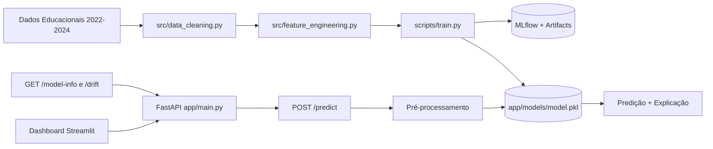
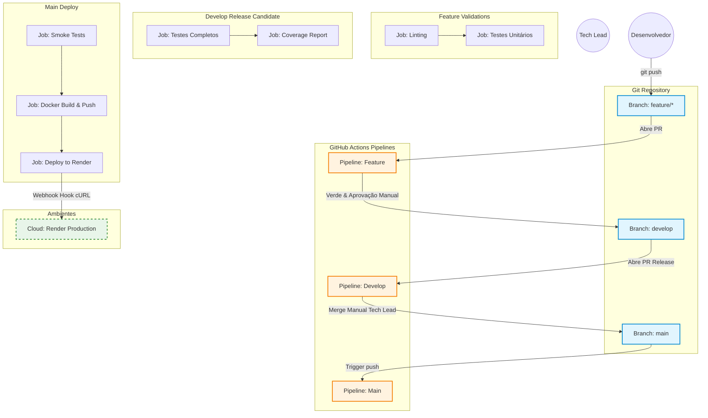

# Projeto Tech Challenge Fase 5

> Esta solução consolida uma arquitetura MLOps completa: inferência assíncrona escalável via FastAPI, orquestração Cloud Native (pronta para K8s), esteira CI/CD rigorosa (GitFlow) e explicabilidade de IA (XAI) para garantir que cada predição do risco de defasagem do aluno é fundamentada e auditável para a Associação Passos Mágicos.

---

## 📌 Índice

- [📝 Sobre o Projeto](#-sobre-o-projeto)
- [🎯 Desafio](#-desafio)
- [🛠 Tecnologias e Ferramentas](#-tecnologias-e-ferramentas)
- [🧱 Arquitetura da Solução](#-arquitetura-da-solução)
- [🗂️ Estrutura de Diretórios](#-estrutura-de-diretórios)
- [🚀 Como Configurar e Executar o Projeto](#-como-configurar-e-executar-o-projeto)
- [✅ Testes e Validações](#-testes-e-validações)
- [🔄 CI/CD Pipeline](#-cicd-pipeline)
- [🤖 IA para Code Review](#-ia-para-code-review)
- [📖 Documentação da API](#-documentação-da-api)
- [📊 Monitoramento e MLflow](#-monitoramento-e-mlflow)
- [🎥 Vídeo Demonstrativo](#-vídeo-demonstrativo)
- [🤝 Desenvolvedores](#-desenvolvedores)
- [⚖️ Licença](#-licença)
- [📚 Documentação Adicional](#-documentação-adicional)
- [🌟 Agradecimentos](#-agradecimentos)

---

## 📝 Sobre o Projeto

Este repositório contém a implementação do **Tech Challenge Fase 5 da Pós-Graduação em Machine Learning**, com foco em **análise e predição do desenvolvimento educacional** de crianças e jovens atendidos pela **Associação Passos Mágicos**.

### 🌟 Associação Passos Mágicos

**Mudando a vida de crianças e jovens por meio da educação.**

A Associação Passos Mágicos possui mais de três décadas de atuação e trabalha na transformação da vida de crianças e jovens em vulnerabilidade social, ampliando suas oportunidades por meio da educação. A iniciativa foi idealizada por **Michelle Flues** e **Dimetri Ivanoff**, com início em **1992**, em **Embu-Guaçu**.

Em **2016**, o programa foi ampliado para alcançar mais jovens, sustentado por quatro pilares:
- ✨ **Educação de qualidade**
- 🧠 **Auxílio psicológico/psicopedagógico**
- 🌍 **Ampliação da visão de mundo**
- 💪 **Protagonismo**

### ✨ Funcionalidades Principais

- **Análise de dados educacionais** com foco em evolução histórica dos alunos.
- **Predição de desempenho** com modelos de Machine Learning.
- **Identificação de padrões** que influenciam o progresso escolar.
- **API REST** para predição, auditoria, monitoramento e ciclo de retreinamento.
- **Dashboard interativo** em Streamlit para visualização e exploração dos dados.
- **Pipeline de treinamento** com estratégia champion/challenger.
- **Monitoramento com MLflow** para métricas, parâmetros e artefatos.
- **Containerização com Docker** para execução padronizada.
- **Deploy no Render** com container único, Nginx e Supervisor.
- **CI/CD com GitHub Actions** em fluxo GitFlow (feature → develop → main).
- **Cobertura de testes** com meta mínima de **85%**.
- **IA para code review** com instruções customizadas de qualidade.

---

## 🎯 Desafio

Com base no dataset de desenvolvimento educacional dos anos **2022, 2023 e 2024**, o projeto propõe um desafio de **Machine Learning Engineering** com impacto social real: antecipar risco de defasagem e apoiar decisões pedagógicas mais assertivas.

---

## 🛠 Tecnologias e Ferramentas

### 🎯 Stack Principal

| Ferramenta | Categoria | Utilização no Projeto |
|------------|-----------|----------------------|
| 🐍 **Python 3.11+** | Linguagem | Base para ML, API e automações |
| ⚡ **FastAPI** | Framework Web | API REST com documentação automática |
| 🎨 **Streamlit** | Dashboard | Interface de análise e operação de modelo |
| 🌐 **Nginx** | Reverse Proxy | Roteamento unificado (`/`, `/api`, `/dashboard`) |

### 🤖 Machine Learning & Ciência de Dados

| Ferramenta | Categoria | Utilização no Projeto |
|------------|-----------|----------------------|
| 📦 **scikit-learn** | ML | Modelo preditivo principal |
| 📊 **NumPy & Pandas** | Dados | Processamento e transformação de dados |
| 📈 **Matplotlib & Seaborn** | Visualização | Gráficos e análises de apoio |
| 🔍 **MLflow** | MLOps | Tracking de experimentos e artefatos |

### 🧪 Qualidade & Testes

| Ferramenta | Categoria | Utilização no Projeto |
|------------|-----------|----------------------|
| 🧪 **Pytest** | Testes | Testes unitários e de integração |
| 🎯 **pytest-cov** | Coverage | Medição e reporte de cobertura |
| ✨ **Ruff** | Lint/Format | Qualidade de código e formatação |
| 🔤 **MyPy** | Type Checking | Verificação de tipos estáticos |

### 🔒 Segurança

| Ferramenta | Categoria | Utilização no Projeto |
|------------|-----------|----------------------|
| 🛡️ **Bandit** | Scanner | Análise de vulnerabilidades Python |
| 🔑 **detect-secrets** | Scanner | Prevenção de vazamento de segredos |

### 🐳 Infraestrutura & DevOps

| Ferramenta | Categoria | Utilização no Projeto |
|------------|-----------|----------------------|
| 🐳 **Docker** | Containerização | Imagem única para execução em produção |
| 🐙 **Docker Compose** | Orquestração local | Execução local simplificada |
| 🔄 **GitHub Actions** | CI/CD | Pipelines por branch (feature/develop/main) |
| 🤖 **GitHub Copilot** | IA | Apoio em revisão de código e padronização |

---

## 🧱 Arquitetura da Solução

Arquitetura modular para cobrir o ciclo completo de dados, treino, inferência e operação:
- **Desenvolvimento local**: execução com Docker Compose (porta de entrada única em `http://localhost`).
- **Produção no Render**: container único com **Nginx + FastAPI + Streamlit** sob supervisão do **Supervisor**.

### 🏗️ Arquitetura de Execução

```
graph TD
    %% Acesso Externo
    User((Usuário / ONG)) --> |Acesso HTTPS (Porta 443/80)| Nginx[Nginx Reverse Proxy :80]
    
    %% Roteamento Nginx (Reverse Proxy)
    subgraph Container Orquestration Docker Compose
        Nginx --> |Rota: /api/*| FastAPI[FastAPI Backend :8000]
        Nginx --> |Rota: /dashboard/*| Streamlit[Streamlit UI :8501]
        Nginx --> |Rota: /mlflow/*| MLflow[MLflow Server :5000]
    end
    
    %% Comunicação Interna e Lógica de Negócio
    Streamlit -- "Chamadas REST (Predict/Train)" --> FastAPI
    
    %% Motor MLOps e Persistência
    subgraph MLOps Engine
        FastAPI -- "Lê/Grava" --> MLflowArtifacts[(MLflow Artifacts / mlruns)]
        MLflow -- "Serve" --> MLflowArtifacts
        FastAPI -- "XAI Explainer" --> SHAP[SHAP/LIME]
    end
    
    %% Saídas e Monitoramento
    FastAPI -- "Gera Logs" --> JSONLogs[(Logs Estruturados em JSON)]
    
    %% Estilização
    classDef proxy fill:#ececff,stroke:#9370db,stroke-width:2px,rx:10,ry:10;
    classDef api fill:#e6f3ff,stroke:#4169e1,stroke-width:2px;
    classDef ui fill:#f0fff0,stroke:#2e8b57,stroke-width:2px;
    classDef ops fill:#fff5ee,stroke:#ff8c00,stroke-width:2px;
    classDef db fill:#f5f5f5,stroke:#333,stroke-width:2px,stroke-dasharray: 5 5;
    
    class Nginx proxy;
    class FastAPI api;
    class Streamlit ui;
    class MLflow,SHAP ops;
    class MLflowArtifacts,JSONLogs db;
```

**Roteamento principal via Nginx:**
- `/` → landing page
- `/api/*` → FastAPI
- `/dashboard/*` → Streamlit
- `/health` → health check da API

### 🔄 Pipeline de Dados e ML



### 🎯 Componentes Principais

1. **🌐 Nginx (Reverse Proxy)**: padroniza entrada única e reduz acoplamento entre cliente e serviços internos.
2. **📊 Camada de Dados**: garante limpeza e consistência antes de qualquer inferência.
3. **🛠️ Feature Engineering**: transforma sinais pedagógicos em variáveis úteis ao modelo.
4. **🤖 Camada de Modelo**: mantém ciclo de evolução champion/challenger com rastreabilidade.
5. **⚡ API FastAPI**: expõe endpoints operacionais e auditáveis para integração externa.
6. **🎨 Dashboard Streamlit**: acelera análise funcional por usuários não técnicos.
7. **🔍 Monitoramento com MLflow**: viabiliza comparabilidade entre versões de modelo.
8. **🐳 Infraestrutura Docker**: assegura reprodutibilidade entre desenvolvimento e produção.

---

## 🗂️ Estrutura de Diretórios

Estrutura atual (resumo dos diretórios e arquivos mais relevantes):

```text
fase-5/
├── .github/
│   ├── copilot-instructions.md
│   └── workflows/
│       ├── feature-pipeline.yml
│       ├── develop-pipeline.yml
│       ├── main-pipeline.yml
│       └── issue-ops-rollback.yml
├── app/
│   ├── main.py
│   ├── dashboard.py
│   ├── routes/
│   ├── models/
│   ├── dashboard/
│   └── utils/
├── src/
│   ├── data_cleaning.py
│   ├── feature_engineering.py
│   └── model.py
├── scripts/
│   ├── train.py
│   └── monitoring.py
├── tests/
├── notebooks/
├── docker-compose.yml
├── Dockerfile
├── nginx.conf
├── supervisord.conf
├── render.yaml
├── requirements.txt
├── pyproject.toml
├── pytest.ini
├── Makefile
├── DEPLOYMENT.md
├── TESTING.md
├── TESTING_STRATEGY.md
└── README.md
```

---

## 🚀 Como Configurar e Executar o Projeto

### Pré-requisitos

- **Python 3.11+**
- **Docker** e **Docker Compose** (opcional)
- **Git**
- **Make** (opcional)

### ✅ Caminho Feliz (Recomendado): Docker Compose

```bash
docker compose up --build

# Em segundo plano
docker compose up -d --build

# Logs
docker compose logs -f

# Encerrar
docker compose down
```

Serviços via `http://localhost`:

| Serviço | URL | Descrição |
|---------|-----|-----------|
| 🏠 Landing Page | `http://localhost/` | Página inicial |
| ⚡ API Docs | `http://localhost/api/docs` | Swagger da API |
| 📊 Dashboard | `http://localhost/dashboard/` | Interface Streamlit |
| ❤️ Health Check | `http://localhost/health` | Saúde da aplicação |

### Opção B: Execução Local (Secundária)

#### 1. Clone e instale dependências

```bash
git clone https://github.com/Fiap-Pos-tech-5MLET/fase-5.git
cd fase-5

python -m venv .venv

# Windows
.venv\Scripts\activate
# Linux/macOS
source .venv/bin/activate

pip install --upgrade pip
pip install -r requirements.txt
```

#### 2. Configure variáveis de ambiente

Crie o arquivo `.env` na raiz do projeto (use `.env.example` como base):

```bash
PROJECT_NAME="Tech Challenge Fase 5 - Associação Passos Mágicos"
ENVIRONMENT=development
DATASET_PATH=data/raw/passos_magicos_2022_2024.csv
MODEL_PATH=app/models/model.pkl
```

#### 3. Prepare os dados

Coloque o dataset em `data/raw/` com o nome esperado pelo pipeline.

#### 4. Treine o modelo inicial

```bash
python scripts/train.py
```

Artefatos principais gerados:
- `app/models/model.pkl`
- `app/artifacts/`

#### 5. Execute a API

```bash
uvicorn app.main:app --reload --host 127.0.0.1 --port 8000
```

API local: `http://127.0.0.1:8000`

#### 6. Execute o Dashboard Streamlit

Em outro terminal:

```bash
streamlit run app/dashboard.py --server.port=8501 --server.address=127.0.0.1
```

Dashboard local: `http://127.0.0.1:8501`

---

## ✅ Testes e Validações

O projeto utiliza testes automatizados e validações de qualidade com meta mínima de **85%** de cobertura.

### Executar testes

```bash
# Todos os testes
pytest tests/ -v

# Cobertura
pytest tests/ --cov=src --cov=app --cov-report=term-missing -v

# Relatório HTML
pytest tests/ --cov=src --cov=app --cov-report=html
```

### Verificação de qualidade

```bash
make format
make lint
make type-check
make security
make quality
```

Para mais detalhes, consulte [TESTING.md](TESTING.md).

---

## 🔄 CI/CD Pipeline

O projeto adota pipelines GitHub Actions por branch, alinhados ao fluxo GitFlow.

### Workflows ativos

1. **Feature Pipeline** (`feature-pipeline.yml`)
  - Executa em `feature/*` e `bugfix/*`
  - Valida qualidade, testes rápidos e build Docker
  - Pode abrir PR automático para `develop`

2. **Develop Pipeline** (`develop-pipeline.yml`)
  - Executa em `develop` e PRs para `develop`
  - Valida política de origem da branch
  - Executa qualidade, testes completos, segurança e build Docker
  - Pode abrir PR de release para `main`

3. **Main Pipeline** (`main-pipeline.yml`)
  - Executa em `main` e PRs para `main`
  - Faz smoke tests, build Docker e deploy no Render via deploy hook

4. **IssueOps Rollback** (`issue-ops-rollback.yml`)
  - Workflow de rollback emergencial acionado por label em issue

### Características

- Logs e summaries detalhados por etapa
- Jobs paralelos para reduzir tempo de execução
- Gating por qualidade/segurança antes de avançar de estágio
- Governança de origem de PR entre branches

---

## 🤖 IA para Code Review

O projeto usa **GitHub Copilot** com instruções customizadas para padronização técnica.

### Padrões verificados

- ✅ Type hints em parâmetros e retornos
- ✅ Docstrings em estilo Google (português)
- ✅ Convenções de nomenclatura e organização de código
- ✅ Regras de segurança (inputs, segredos, erros)
- ✅ Boas práticas de testes e cobertura

As diretrizes estão em [.github/copilot-instructions.md](.github/copilot-instructions.md).

---

## 📖 Documentação da API

A API oferece endpoints para predição, auditoria e gestão do ciclo de modelos.

### Documentação interativa

- **Swagger UI (local direto na API):** `http://127.0.0.1:8000/docs`
- **Swagger UI (via Nginx):** `http://localhost/api/docs`
- **ReDoc (local direto na API):** `http://127.0.0.1:8000/redoc`

### Endpoints principais

```http
GET  /health
GET  /
POST /predict
GET  /model-info
GET  /drift
POST /retrain
POST /promote
POST /discard
GET  /model-metrics
GET  /model-artifact/{name}
```

### Exemplo de ingestão via cURL

```bash
curl -X 'POST' \
  'http://localhost:8000/api/predict' \
  -H 'accept: application/json' \
  -H 'x-requested-by: banca_fiap' \
  -H 'Content-Type: application/json' \
  -d '{
  "data": {
    "IDADE": 16,
    "FALTAS": 12,
    "INDE_2023": 6.5
  }
}'
```

> Se estiver usando Docker com Nginx local, utilize `http://localhost/api/predict`.

---

## 📊 Monitoramento e MLflow

O projeto utiliza **MLflow** para rastrear experimentos, parâmetros, métricas e artefatos de treinamento.

### Como acessar

**Execução local (manual):**

```bash
mlflow ui --port 5000
```

MLflow local: `http://127.0.0.1:5000`

> Em produção no Render, o foco principal é API + Dashboard. O uso de MLflow na nuvem depende do perfil de recursos e da configuração do ambiente.

### Métricas rastreadas

- Acurácia, precisão, recall e F1-score
- Curvas e artefatos de avaliação
- Hiperparâmetros de treinamento
- Metadados de execução e versionamento de modelo

---

## 🎥 Vídeo Demonstrativo

Assista ao vídeo explicativo do projeto e de seu funcionamento:

- 📹 **Link do vídeo:** [Em breve]
- 💎 **API pública:** [datathon-machine-learning-engineering](https://datathon-machine-learning-engineering.onrender.com/)
- 📊 **Conteúdo:** arquitetura, API, pipeline de treinamento e resultados

### 📸 Screenshots da Aplicação

**Principais interfaces:**
- 🏠 Landing Page
- 📊 Dashboard Streamlit
- 📖 Swagger da API
- 🔍 Indicadores e artefatos de monitoramento

#### Landing Page

> Adicione aqui o screenshot atualizado da landing page quando disponível.

---

## 🤝 Desenvolvedores

Este projeto foi desenvolvido como parte do **Tech Challenge Fase 5** da **Pós-Graduação em Machine Learning Engineering da FIAP**.

**Equipe 5MLET:**

| Nome | RM | GitHub |
|------|-----|--------|
| Lucas Felipe de Jesus Machado | RM364306 | [@lfjmachado](https://github.com/lfjmachado) |
| Antônio Teixeira Santana Neto | RM364480 | [@antonioteixeirasn](https://github.com/antonioteixeirasn) |
| Gabriela Moreno Rocha dos Santos | RM364538 | [@gabrielaMSantos](https://github.com/gabrielaMSantos) |
| Erik Douglas Alves Gomes | RM364379 | [@Erik-DAG](https://github.com/Erik-DAG) |
| Leonardo Fernandes Soares | RM364648 | [@leferso](https://github.com/leferso) |

---

## ⚖️ Licença

Este projeto está licenciado sob a **Licença MIT**. Consulte o arquivo [LICENSE](LICENSE) para mais detalhes.

---

## 📚 Documentação Adicional

### Guias de testes e qualidade

- **[TESTING.md](TESTING.md)** — Guia completo de testes e cobertura
- **[TESTING_STRATEGY.md](TESTING_STRATEGY.md)** — Estratégia de testes do projeto
- **[IMPLEMENTATION_SUMMARY.md](IMPLEMENTATION_SUMMARY.md)** — Resumo de implementação

### Guias de desenvolvimento e operação

- **[CONTRIBUTING.md](CONTRIBUTING.md)** — Guia de contribuição
- **[DEPLOYMENT.md](DEPLOYMENT.md)** — Guia de deploy
- **[.github/copilot-instructions.md](.github/copilot-instructions.md)** — Diretrizes de code review com IA

---

## 🌟 Agradecimentos

- **FIAP** — Pela estrutura e qualidade da pós-graduação.
- **Professores** — Pelo conhecimento compartilhado e orientação.
- **Associação Passos Mágicos** — Pelos dados e pela inspiração para um projeto com impacto social por meio da educação.

---