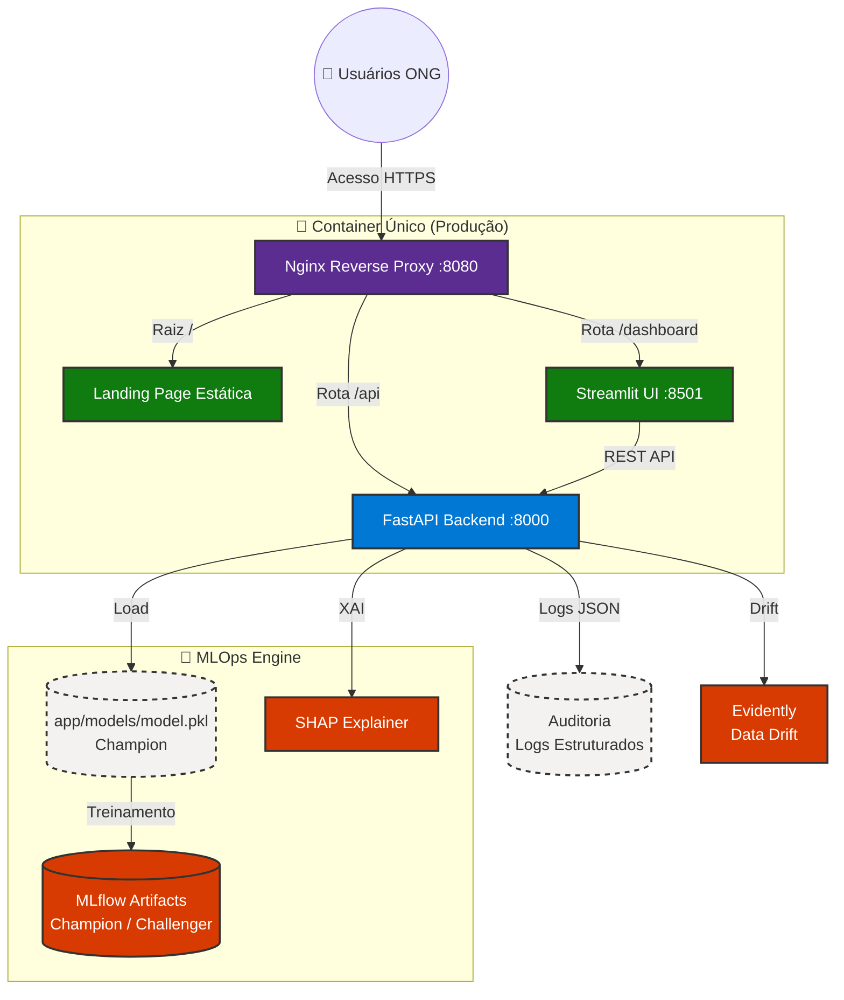
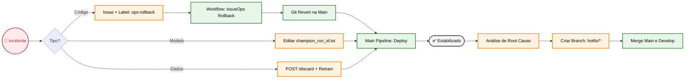

# Projeto Tech Challenge Fase 5

> Esta solução consolida uma arquitetura MLOps completa: inferência assíncrona escalável via FastAPI, orquestração Cloud Native (pronta para K8s), esteira CI/CD rigorosa (GitFlow) e explicabilidade de IA (XAI) para garantir que cada predição do risco de defasagem do aluno é fundamentada e auditável para a Associação Passos Mágicos.

---

## 📌 Índice

- [📝 Sobre o Projeto](#-sobre-o-projeto)
- [🎯 Desafio](#-desafio)
- [🛠 Tecnologias e Ferramentas](#-tecnologias-e-ferramentas)
- [🧱 Arquitetura da Solução](#-arquitetura-da-solução)
- [🗂️ Estrutura de Diretórios](#-estrutura-de-diretórios)
- [🚀 Como Configurar e Executar o Projeto](#-como-configurar-e-executar-o-projeto)
- [✅ Testes e Validações](#-testes-e-validações)
- [🔄 CI/CD Pipeline](#-cicd-pipeline)
- [🤖 IA para Code Review](#-ia-para-code-review)
- [📖 Documentação da API](#-documentação-da-api)
- [📊 Monitoramento e MLflow](#-monitoramento-e-mlflow)
- [🎥 Vídeo Demonstrativo](#-vídeo-demonstrativo)
- [🤝 Desenvolvedores](#-desenvolvedores)
- [⚖️ Licença](#-licença)
- [📚 Documentação Adicional](#-documentação-adicional)
- [🌟 Agradecimentos](#-agradecimentos)

---

## 📝 Sobre o Projeto

Este repositório contém a implementação do **Tech Challenge Fase 5 da Pós-Graduação em Machine Learning**, com foco em **análise e predição do desenvolvimento educacional** de crianças e jovens atendidos pela **Associação Passos Mágicos**.

### 🌟 Associação Passos Mágicos

**Mudando a vida de crianças e jovens por meio da educação.**

A Associação Passos Mágicos possui mais de três décadas de atuação e trabalha na transformação da vida de crianças e jovens em vulnerabilidade social, ampliando suas oportunidades por meio da educação. A iniciativa foi idealizada por **Michelle Flues** e **Dimetri Ivanoff**, com início em **1992**, em **Embu-Guaçu**.

Em **2016**, o programa foi ampliado para alcançar mais jovens, sustentado por quatro pilares:
- ✨ **Educação de qualidade**
- 🧠 **Auxílio psicológico/psicopedagógico**
- 🌍 **Ampliação da visão de mundo**
- 💪 **Protagonismo**

### ✨ Funcionalidades Principais

- **Análise de dados educacionais** com foco em evolução histórica dos alunos.
- **Predição de desempenho** com modelos de Machine Learning.
- **Identificação de padrões** que influenciam o progresso escolar.
- **API REST** para predição, auditoria, monitoramento e ciclo de retreinamento.
- **Dashboard interativo** em Streamlit para visualização e exploração dos dados (com health check de API).
- **Pipeline de treinamento** com estratégia champion/challenger.
- **Monitoramento com MLflow** para métricas, parâmetros e artefatos.
- **Containerização com Docker** para execução padronizada.
- **Deploy no Render** com container único, Nginx e Supervisor.
- **CI/CD com GitHub Actions** em fluxo GitFlow (feature → develop → main).
- **Cobertura de testes** com meta mínima de **85%**.
- **IA para code review** com instruções customizadas de qualidade.

---

## 🎯 Desafio

Com base no dataset de desenvolvimento educacional dos anos **2022, 2023 e 2024**, o projeto propõe um desafio de **Machine Learning Engineering** com impacto social real: antecipar risco de defasagem e apoiar decisões pedagógicas mais assertivas.

---

## 🛠 Tecnologias e Ferramentas

### 🎯 Stack Principal

| Ferramenta | Categoria | Utilização no Projeto |
|------------|-----------|----------------------|
| 🐍 **Python 3.11+** | Linguagem | Base para ML, API e automações |
| ⚡ **FastAPI** | Framework Web | API REST com documentação automática |
| 🎨 **Streamlit** | Dashboard | Interface de análise e operação de modelo |
| 🌐 **Nginx** | Reverse Proxy | Roteamento unificado (`/`, `/api`, `/dashboard`) |

### 🤖 Machine Learning & Ciência de Dados

| Ferramenta | Categoria | Utilização no Projeto |
|------------|-----------|----------------------|
| 📦 **scikit-learn** | ML | Modelo preditivo principal |
| 📊 **NumPy & Pandas** | Dados | Processamento e transformação de dados |
| 📈 **Matplotlib & Seaborn** | Visualização | Gráficos e análises de apoio |
| 🔍 **MLflow** | MLOps | Tracking de experimentos e artefatos |

### 🧪 Qualidade & Testes

| Ferramenta | Categoria | Utilização no Projeto |
|------------|-----------|----------------------|
| 🧪 **Pytest** | Testes | Testes unitários e de integração |
| 🎯 **pytest-cov** | Coverage | Medição e reporte de cobertura |
| ✨ **Ruff** | Lint/Format | Qualidade de código e formatação |
| 🔤 **MyPy** | Type Checking | Verificação de tipos estáticos |

### 🔒 Segurança

| Ferramenta | Categoria | Utilização no Projeto |
|------------|-----------|----------------------|
| 🛡️ **Bandit** | Scanner | Análise de vulnerabilidades Python |
| 🔑 **detect-secrets** | Scanner | Prevenção de vazamento de segredos |

### 🐳 Infraestrutura & DevOps

| Ferramenta | Categoria | Utilização no Projeto |
|------------|-----------|----------------------|
| 🐳 **Docker** | Containerização | Imagem única para execução em produção |
| 🐙 **Docker Compose** | Orquestração local | Execução local simplificada |
| 🏗️ **Render IaC (`render.yaml`)** | Infra as Code | Contrato de deploy e variáveis operacionais |
| 🔄 **GitHub Actions** | CI/CD | Pipelines por branch (feature/develop/main) |
| 🤖 **GitHub Copilot** | IA | Apoio em revisão de código e padronização |

---

## 🧱 Arquitetura da Solução

Arquitetura modular e escalável para cobrir o ciclo completo: dados → treino → inferência → operação. Otimizada para desenvolvimento local (Docker Compose) e produção (Render + container único).

**Premissas principais:**
- **Desenvolvimento local**: Docker Compose com entrada única em `http://localhost`
- **Produção no Render**: Container único com **Nginx + FastAPI + Streamlit + Supervisor**
- **MLOps**: Champion/Challenger com MLflow para rastreabilidade completa
- **Segurança**: Rotas sensíveis protegidas por `X-API-KEY`, dados auditados

### 📚 Stack Tecnológico e Justificativa

| Componente | Tecnologia | Justificativa |
|------------|-----------|---------------|
| **Web Server** | Nginx | Reverse proxy único, suporta múltiplas rotas, eficiente, leve |
| **API Backend** | FastAPI | Validação automática (Pydantic), async nativo, docs automáticas |
| **Dashboard** | Streamlit | Prototipagem rápida, sem HTML/CSS, deploy simples |
| **Processamento** | Scikit-learn | Modelos clássicos rápidos, interpretáveis, sem GPU |
| **Explicabilidade** | SHAP + LIME | XAI standards, modelos agnósticos |
| **Rastreabilidade** | MLflow | Versionamento de modelos, métricas, artefatos |
| **Drift Detection** | Evidently | Detecção de data/model drift pronta para produção |
| **Orchestração Local** | Docker Compose | Reprodutibilidade desenvolvimento ↔ produção |
| **Orchestração Produção** | Supervisor | Process manager no container único |
| **Testes** | Pytest + Coverage | Mínimo 85% cobertura, fixtures reutilizáveis |
| **Deploy** | GitHub Actions + Render | CI/CD GitFlow, IaC com render.yaml |

### 1. 🏗️ Arquitetura de Execução



**Roteamento principal via Nginx:**

| Rota | Destino | Descrição |
|------|---------|-----------|
| `/` | Landing page estática | Página inicial |
| `/api/*` | FastAPI :8000 | Endpoints REST (protegidos) |
| `/dashboard/*` | Streamlit :8501 | Interface interativa |
| `/api/health` | FastAPI | Health check (sem autenticação) |
| `/api/docs` | FastAPI | Swagger UI (sem autenticação) |

**Portas internas (não expostas):**
- FastAPI escuta em `:8000`
- Streamlit escuta em `:8501`
- MLflow (se local) em `:5000`

### 2. 🔄 Pipeline de Dados e ML

```mermaid
flowchart LR
    %% Entrada de Dados
    Data[(Dataset Excel<br/>BASE DE DADOS<br/>PEDE 2024)] --> Load["1️⃣ Carga<br/>load_data()"]
    
    %% Etapas de Preparação
    subgraph Prep ["🔧 Preparação (src/)"]
        direction TB
        Load --> Clean["2️⃣ Limpeza<br/>clean_data()"]
        Clean --> Target["3️⃣ Target Criação<br/>create_target()"]
        Target --> Missing["4️⃣ Imputação<br/>handle_missing_values()"]
        Missing --> Feature["5️⃣ Feature Engineering<br/>create_features()"]
        Feature --> Store["6️⃣ Feature Store<br/>versionamento"]
    end

    %% Treino
    Store --> Train["🤖 Treino<br/>scripts/train.py"]
    
    %% Artefatos
    Train --> Champion[(🏆 Model Champion<br/>app/models/model.pkl)]
    Train --> Artifacts[(📦 Artifacts<br/>MLflow Experiments<br/>Métricas + Plots)]

    %% Ciclo de Inferência
    subgraph Predict ["⚡ Inferência (app/routes/)"]
        direction TB
        Input["📥 Input Aluno<br/>StudentInput"] --> Align["Alinhamento Features"]
        Align --> Validation["Validação<br/>Schema + Range"]
        Validation --> Champion
        Champion --> Result["🎯 Predição<br/>+ Probabilidade<br/>+ SHAP Explain"]
    end

    %% Monitoramento
    Result --> Audit["📋 Auditoria<br/>JSON Logs"]
    Result --> Drift["📊 Monitor Drift<br/>Evidently"]

    %% Estilização
    classDef prep fill:#e3f2fd,stroke:#1976d2,stroke-width:2px,color:#000;
    classDef predict fill:#f3f2f1,stroke:#616161,stroke-width:2px,color:#000;
    classDef train fill:#fff3e0,stroke:#f57c00,stroke-width:2px,color:#000;
    classDef monitor fill:#e8f5e9,stroke:#388e3c,stroke-width:2px,color:#000;
    classDef dbs fill:#fce4ec,stroke:#c2185b,stroke-width:2px,color:#000;

    class Prep prep;
    class Predict predict;
    class Train train;
    class Audit,Drift monitor;
    class Data,Champion,Artifacts dbs;
```



**Fluxos principais:**

1. **Ingestão de Dados** → `/update-data` POST endpoint auditado
2. **Treinamento** → `scripts/train.py` com MLflow tracking automático
3. **Inferência** → `/predict` POST endpoint com XAI explicability
4. **Monitoramento** → `/drift` GET endpoint com Evidently

### 3. 🎯 Componentes Principais e Responsabilidades

#### **Camada 1: Entrada (Nginx)**
- Centraliza acesso HTTPS
- Padroniza URLs internas (`/api`, `/dashboard`)
- Reduz acoplamento cliente ↔ serviços
- Suporta gzip, caching, rate limiting (configurável)

#### **Camada 2: API (FastAPI + Routes)**
| Rota | Método | Proteção | Responsabilidade |
|------|--------|----------|-----------------|
| `/health` | GET | ❌ Pública | Status da API e modelo |
| `/` | GET | ❌ Pública | Info da aplicação |
| `/predict` | POST | ❌ Pública | **Predição com XAI** |
| `/drift` | GET | ❌ Pública | Relatório de dados drift |
| `/model-info` | GET | ❌ Pública | Metadados do modelo |
| `/model-metrics` | GET | ❌ Pública | Métricas de performance |
| `/update-data` | POST | ✅ API-KEY | **Ingestão de dados com auditoria** |
| `/retrain` | POST | ✅ API-KEY | **Criar challenger** |
| `/promote` | POST | ✅ API-KEY | **Promover para champion** |
| `/discard` | POST | ✅ API-KEY | **Descartar challenger** |
| `/model-artifact/{name}` | GET | ✅ API-KEY | **Download de artefatos** |

#### **Camada 3: Dashboard (Streamlit)**
- Páginas: Prediction, Metrics, Drift Detection, Retrain, About
- API-driven: chamadas para FastAPI endpoints
- Cache: `@st.cache_data`, `@st.cache_resource`
- Autenticação: herda de `API_URL` (API-KEY em headers)

#### **Camada 4: Processamento (src/)**
- `data_cleaning.py` → Limpeza, remoção de outliers
- `feature_engineering.py` → Transformações de features
- `feature_store.py` → Versionamento de features
- `model.py` → Treino e validação de modelos

#### **Camada 5: MLOps (scripts/ + MLflow)**
- `scripts/train.py` → Orquestração de treino
- Champion/Challenger gerenciados em MLflow
- Métricas automáticas: acurácia, AUC, F1, matriz confusão
- Artefatos: modelos pickle, exploratory reports

#### **Camada 6: Utilidades (app/utils/)**
| Módulo | Responsabilidade |
|--------|-----------------|
| `model_loader.py` | Load/cache do modelo champion |
| `security.py` | Validação de `X-API-KEY` |
| `structured_logging.py` | Logs JSON estruturados para auditoria |
| `xai.py` | SHAP values para explicabilidade |
| `keep_alive.py` | Ping para manter Render free tier ativo |

### 4. 📊 Fluxo de Dados Detalhado

**Timeline de uma predição end-to-end:**

```
1. Cliente envía POST /predict com StudentInput
   ↓
2. FastAPI valida schema (Pydantic)
   ↓
3. app/utils/model_loader.py carrega modelo champion (cached)
   ↓
4. app/routes/predict_route.py:
   - Alinha features do input com features de treino
   - Executa predição sklearn
   - Calcula SHAP values
   ↓
5. Retorna JSON com:
   - prediction: classe predita (0/1)
   - probability: confiança [0, 1]
   - shap_values: explicações por feature
   ↓
6. app/utils/structured_logging.py registra auditoria:
   - Timestamp, input, output, latência
   - Run ID do modelo
   ↓
7. Retorna 200 OK com resposta JSON
```

### 5. 🔐 Estratégia de Segurança

**Em Rotas Públicas (`/predict`, `/drift`, `/health`):**
- Sem autenticação
- Rate limiting (configurável em Nginx)
- Validação rigorosa de input via Pydantic

**Em Rotas Sensíveis (`/retrain`, `/promote`, `/discard`, `/update-data`):**
- `X-API-KEY` obrigatório no header
- Implementado em `app/utils/security.py`
- API_KEY vem de variável de ambiente
- Sem hardcode de secrets

**Logging e Auditoria:**
- Todas as requisições são logadas em JSON
- Erros incluem contexto sem expor segredos
- Logs estruturados para análise posterior

### 6. 🚀 Estratégia de Deploy

| Ambiente | Execução | Orchestração | Monitoramento |
|----------|----------|--------------|---------------|
| **Desenvolvimento** | Localhost | Docker Compose | Logs stdout |
| **Staging** | Render preview | GitHub Actions | Smoke tests |
| **Produção** | Render free | Supervisor + Nginx | MLflow + Evidently |

**Deployments em Produção:**
1. Merge em `main` dispara `main-pipeline.yml`
2. Validações: `render.yaml`, testes, segurança
3. Build Docker e push (Render detecta)
4. Smoke tests pós-deploy
5. Auto-rollback se detectar falhas críticas

### 7. 📈 Decisões Arquiteturais Principais

| Decisão | Justificativa |
|---------|---------------|
| **Container único** | Render free tier, menor overhead, mais simples operacionalmente |
| **Nginx reverse proxy** | Flexibilidade de rotas, desacoplamento, cache/gzip |
| **FastAPI + Streamlit** | FastAPI para API robusta, Streamlit para dashboard rápido |
| **Champion/Challenger** | Validação de modelos antes de produção, rollback fácil |
| **MLflow artifacts** | Versionamento, comparação, reprodutibilidade |
| **Scikit-learn** | Modelos clássicos, interpretáveis, sem dependências pesadas |
| **SHAP XAI** | Explicabilidade agnóstica, integrada em predições |
| **Logs JSON** | Parseable para análise, auditoria estruturada |
| **GitHub Actions** | CI/CD integrado, sem custo, GitFlow nativo |

---

## 🗂️ Estrutura de Diretórios

Organização dos arquivos conforme padrão MVC adaptado para ML:

```text
fase-5/
├── .github/                           # Workflows CI/CD e instruções para IA
│   ├── copilot-instructions.md        # Diretrizes de code review completas
│   ├── copilot-operational-runbook.md # Runbook de troubleshooting operacional
│   └── workflows/                     # Pipelines GitHub Actions
│       ├── feature-pipeline.yml       # Pipeline para branches feature/* (rápido)
│       ├── develop-pipeline.yml       # Pipeline para branch develop (completo)
│       ├── main-pipeline.yml          # Pipeline para branch main (deploy produção)
│       └── issue-ops-rollback.yml     # Workflow de rollback emergencial via issue
│
├── app/                               # Aplicação principal (API + Dashboard)
│   ├── main.py                        # FastAPI app (root_path="/api")
│   ├── dashboard.py                   # Entry point Streamlit
│   ├── config.py                      # Configurações e variáveis de ambiente
│   ├── routes/                        # Rotas da API
│   │   ├── predict_route.py           # POST /predict (inferência + XAI)
│   │   ├── train_route.py             # POST /retrain, /promote, /discard (MLOps)
│   │   └── audit_route.py             # POST /update-data, GET /drift (dados + monitoramento)
│   ├── models/                        # Artefatos de modelos
│   │   ├── model.pkl                  # Scikit-learn model (champion)
│   │   ├── champion_run_id.txt        # MLflow run ID em produção
│   │   └── candidate_run_id.txt       # MLflow run ID do challenger
│   ├── dashboard/                     # Módulos do dashboard Streamlit
│   │   ├── config.py                  # Config do Streamlit
│   │   ├── sidebar.py                 # Sidebar componente
│   │   ├── styles.py                  # CSS customizado
│   │   ├── data.py                    # Carregamento de dados
│   │   └── pages/                     # Páginas Streamlit
│   │       ├── prediction.py          # Página de predição
│   │       ├── metrics.py             # Página de métricas
│   │       ├── drift.py               # Página de drift detection
│   │       ├── retrain.py             # Página de retreinamento
│   │       └── about.py               # Página sobre
│   ├── utils/                         # Utilidades
│   │   ├── model_loader.py            # Carregamento + cache de modelo
│   │   ├── security.py                # Validação de X-API-KEY
│   │   ├── structured_logging.py      # Logs JSON auditados
│   │   ├── xai.py                     # SHAP explainability
│   │   └── keep_alive.py              # Keep-alive para Render
│   ├── data/                          # Dados (raw, processed, outputs)
│   └── artifacts/                     # Artefatos de treino (reports, gráficos)
│
├── src/                               # Pipeline de dados e treinamento
│   ├── data_cleaning.py               # Limpeza de dados
│   ├── feature_engineering.py         # Transformações de features
│   ├── feature_store.py               # Versionamento de features
│   └── model.py                       # Treino e validação
│
├── scripts/                           # Scripts de automação
│   ├── train.py                       # Orquestração de treino com MLflow
│   └── monitoring.py                  # Scripts de monitoramento
│
├── tests/                             # Suite completa (85%+ cobertura)
│   ├── conftest.py                    # Fixtures pytest
│   ├── test_*.py                      # 20+ arquivos de testes
│   └── test_deployment_config.py      # Validação de deployment
│
├── notebooks/                         # Análises exploratórias
│   ├── DATATHON-PASSOS-MÁGICOS.ipynb # Notebook principal (refatorado)
│   └── data_preprocessing_passos_magicos.ipynb
│
├── k8s/                               # Manifestos Kubernetes (opcional, futuro)
│
├── docker-compose.yml                 # Orquestração local
├── Dockerfile                         # Imagem single-stage para produção
├── nginx.conf                         # Configuração reverse proxy
├── supervisord.conf                   # Orquestração de processos
├── render.yaml                        # IaC para Render (Blueprint, futuro)
├── requirements.txt                   # Dependências Python
├── pyproject.toml                     # Config ferramentas (ruff, mypy, etc)
├── pytest.ini                         # Config pytest (cobertura 85%)
├── Makefile                           # Comandos úteis
├── DEPLOYMENT.md                      # Guia de deploy
├── TESTING.md                         # Guia de testes
├── TESTING_STRATEGY.md                # Estratégia de testes
├── IMPLEMENTATION_SUMMARY.md          # Resumo técnico
├── CONTRIBUTING.md                    # Guia de contribuição
└── README.md                          # Este arquivo
```

---

## 🚀 Como Configurar e Executar o Projeto

### Pré-requisitos

- **Python 3.11+**
- **Docker** e **Docker Compose** (opcional)
- **Git**
- **Make** (opcional)

### ✅ Caminho Feliz (Recomendado): Docker Compose

```bash
docker compose up --build

# Em segundo plano
docker compose up -d --build

# Logs
docker compose logs -f

# Encerrar
docker compose down
```

Serviços via `http://localhost`:

| Serviço | URL | Descrição |
|---------|-----|-----------|
| 🏠 Landing Page | `http://localhost/` | Página inicial |
| ⚡ API Docs | `http://localhost/api/docs` | Swagger da API |
| 📊 Dashboard | `http://localhost/dashboard/` | Interface Streamlit |
| ❤️ Health Check | `http://localhost/health` | Saúde da aplicação |

### Opção B: Execução Local (Secundária)

#### 1. Clone e instale dependências

```bash
git clone https://github.com/Fiap-Pos-tech-5MLET/fase-5.git
cd fase-5

python -m venv .venv

# Windows
.venv\Scripts\activate
# Linux/macOS
source .venv/bin/activate

pip install --upgrade pip
pip install -r requirements.txt
```

#### 2. Configure variáveis de ambiente

Para a **Opção B (execução local manual)**, crie o arquivo `.env` na raiz do projeto
(use `.env.example` como base):

```bash
ENVIRONMENT=development
API_URL=http://127.0.0.1:8000
MODEL_PATH=app/models/model.pkl
DATASET_PATH=app/data/raw/BASE DE DADOS PEDE 2024 - DATATHON.xlsx
ARTIFACTS_DIR=app/artifacts
KEEP_ALIVE_INTERVAL=600
MLFLOW_TRACKING_URI=file:./mlruns
API_KEY=troque_para_uma_chave_forte_em_producao
```

Observações rápidas:
- Em Docker Compose, os padrões do projeto já cobrem a maior parte dos cenários locais.
- Em produção no Render (serviço manual sem Blueprint), configure as variáveis no painel
  **Service → Environment**.

#### 3. Prepare os dados

Coloque o dataset em `app/data/raw/` com o nome esperado pelo pipeline.

#### 4. Treine o modelo inicial

```bash
python scripts/train.py
```

Artefatos principais gerados:
- `app/models/model.pkl`
- `app/artifacts/`

#### 5. Execute a API

```bash
uvicorn app.main:app --reload --host 127.0.0.1 --port 8000
```

API local: `http://127.0.0.1:8000`

#### 6. Execute o Dashboard Streamlit

Em outro terminal:

```bash
streamlit run app/dashboard.py --server.port=8501 --server.address=127.0.0.1
```

Dashboard local: `http://127.0.0.1:8501`

---

## ✅ Testes e Validações

O projeto utiliza uma estratégia abrangente de testes automatizados com **meta mínima de 85%** de cobertura, garantindo qualidade e confiabilidade do código.

### 📊 Cobertura de Código

Os testes cobrem os seguintes diretórios principais:

- **`src/`** — Pipeline de dados e ML (data cleaning, feature engineering, feature store, modelo)
- **`app/`** — Aplicação completa (API FastAPI, Dashboard Streamlit, rotas, utilitários)
- **`scripts/`** — Scripts de utilidades (treinamento, monitoramento, processamento, visualização)

### 🧪 Tipos de Testes

A suite de testes está organizada por categorias:

#### 1. Testes de API e Rotas
- **`test_main.py`** — Aplicação FastAPI principal
- **`test_predict_route.py`** — Endpoint de predição e XAI
- **`test_train_route.py`** — Endpoints de retreinamento (champion/challenger)
- **`test_audit_route.py`** — Endpoints de auditoria e monitoramento
- **`test_schemas.py`** — Validação de schemas Pydantic

#### 2. Testes de Pipeline de Dados e ML
- **`test_data_cleaning.py`** — Limpeza e preparação de dados
- **`test_feature_engineering.py`** — Engenharia de features
- **`test_feature_store.py`** — Armazenamento de features
- **`test_model.py`** — Treinamento e validação de modelos

#### 3. Testes de Dashboard
- **`test_dashboard.py`** — Testes gerais do dashboard
- **`test_dashboard_config.py`** — Configuração do dashboard
- **`test_dashboard_data.py`** — Funções de carregamento de dados
- **`test_dashboard_pages.py`** — Páginas do dashboard
- **`test_dashboard_sidebar.py`** — Barra lateral
- **`test_dashboard_styles.py`** — Estilos customizados
- **`test_dashboard_entry.py`** — Entry point e roteamento
- **`test_dashboard_rendering.py`** — Renderização de componentes

#### 4. Testes de Utilitários
- **`test_model_loader.py`** — Carregamento e validação de modelos
- **`test_xai_utils.py`** — Explicabilidade (SHAP/LIME)
- **`test_structured_logging.py`** — Logging estruturado
- **`test_keep_alive.py`** — Keep-alive para Render

#### 5. Testes de Configuração e Infraestrutura
- **`test_app_config.py`** — Configurações da aplicação
- **`test_deployment_config.py`** — Validação de configuração de deploy (render.yaml)

#### 6. Testes de Scripts e Utilitários
- **`test_train.py`** — Script de treinamento e MLflow
- **`test_visualization.py`** — Visualização de gráficos (ROC, importância, etc)
- **`test_monitoring.py`** — Monitoramento de aplicação
- **`test_data_processing.py`** — Processamento de dados em lote
- **`test_eda_analysis.py`** — Análise exploratória de dados
- **`test_datathon_cleaning.py`** — Limpeza específica do datathon
- **`test_notebook_feature_engineering.py`** — Feature engineering em notebooks
- **`test_cleanup_repo.py`** — Limpeza de repositório

### 🏷️ Markers de Testes

Os testes estão organizados com markers pytest para execução seletiva:

```bash
# Apenas testes unitários
pytest -m unit

# Apenas testes de integração
pytest -m integration

# Testes específicos de API
pytest -m api

# Testes de pipeline de dados
pytest -m "data_loading or data_cleaning or feature_engineering"

# Testes do dashboard
pytest -m dashboard
```

**Markers disponíveis:**
- `unit` — Testes unitários para funções/classes individuais
- `integration` — Testes de integração para funcionalidades combinadas
- `api` — Testes de endpoints da API
- `schemas` — Testes de validação de schemas Pydantic
- `dashboard` — Testes do dashboard Streamlit
- `data_loading` — Testes de carregamento de dados
- `data_cleaning` — Testes de limpeza de dados
- `feature_engineering` — Testes de feature engineering
- `model_training` — Testes de treinamento de modelo
- `slow` — Testes que demandam mais tempo
- `gpu` — Testes que requerem GPU (se aplicável)

### 🚀 Executar Testes

#### Execução básica

```bash
# Todos os testes com output verbose
pytest tests/ -v

# Testes com cobertura
pytest tests/ --cov=src --cov=app --cov-report=term-missing -v

# Relatório HTML de cobertura (gerado em htmlcov/)
pytest tests/ --cov=src --cov=app --cov-report=html

# Executar teste específico
pytest tests/test_predict_route.py -v

# Executar testes com palavra-chave
pytest -k "test_predict" -v
```

#### Execução com markers

```bash
# Apenas testes unitários
pytest -m unit -v

# Apenas testes de API
pytest -m api -v

# Testes rápidos (excluindo lentos)
pytest -m "not slow" -v
```

### 🔍 Verificação de Qualidade

O projeto utiliza múltiplas ferramentas para garantir qualidade de código:

```bash
# Formatação automática com Ruff
make format

# Linting (análise estática)
make lint

# Verificação de tipos com MyPy
make type-check

# Análise de segurança (Bandit + detect-secrets)
make security

# Verificação completa de qualidade
make quality
```

### 📈 Relatórios de Cobertura

Após executar os testes com cobertura, os relatórios ficam disponíveis em:

- **Terminal:** resumo com linhas não cobertas
- **HTML:** relatório detalhado em `htmlcov/index.html` (abrir no navegador)

```bash
# Gerar e abrir relatório HTML
pytest tests/ --cov=src --cov=app --cov-report=html
# Windows
start htmlcov/index.html
# Linux/macOS
open htmlcov/index.html
```

### 🧩 Fixtures e Configuração

O arquivo **`tests/conftest.py`** contém:

- Mocks de bibliotecas pesadas (MLflow, Streamlit, Plotly)
- Configuração de paths do projeto
- Fixtures compartilhadas entre testes
- Configuração de markers pytest
- Seed para reprodutibilidade de testes

Esta abordagem garante que os testes executem rapidamente sem dependências externas pesadas.

---

## 2. 🔄 Esteira CI/CD

O projeto adota pipelines GitHub Actions por branch, alinhados ao fluxo GitFlow. Cada branch tem sua própria estratégia de validação, com gatilhos progressivos de qualidade e segurança.

### 📊 Fluxo de Pipelines

```mermaid
flowchart LR
    classDef event fill:#f5f5f5,stroke:#424242,stroke-width:2px,color:#000;
    classDef feat fill:#fff3e0,stroke:#f57c00,stroke-width:2px,color:#000;
    classDef dev fill:#e3f2fd,stroke:#1976d2,stroke-width:2px,color:#000;
    classDef prod fill:#e8f5e9,stroke:#388e3c,stroke-width:2px,color:#000;

    Start([Push feature/*]):::event --> P1_1
    subgraph P1 [1. Pipeline Feature]
        P1_1(Linting Ruff):::feat --> P1_2(Testes Pytest):::feat
        P1_1 --> P1_3(Build Docker):::feat
        P1_2 --> P1_4(Automação PR):::feat
        P1_3 --> P1_4
    end
    P1_4 --> APR1([Merge develop]):::event
    APR1 --> P2_1
    subgraph P2 [2. Pipeline Develop]
    P2_1(Qualidade: Ruff + MyPy):::dev --> P2_3(Testes + Coverage):::dev
    P2_1 --> P2_4(Segurança: Bandit + Secrets):::dev
        P2_3 --> P2_5(Build Docker):::dev
        P2_4 --> P2_5
        P2_5 --> P2_6(Automação PR Release):::dev
    end
    P2_6 --> APR2([Merge main]):::event
    APR2 --> P3_1
    subgraph P3 [3. Pipeline Main]
    P3_1(Validar Origem PR):::prod --> P3_1a(Validar render.yaml):::prod
    P3_1a --> P3_2(Smoke Tests):::prod
      P3_2 --> P3_3(Build Docker):::prod
    P3_3 --> P3_4(Deploy Render):::prod
    P3_4 --> P3_5(Post-Deploy Smoke):::prod
    P3_5 --> P3_6(Auto Rollback em Falha):::prod
    end
  P3_6 --> F([API em Produção]):::event
```



### 🚀 1. Pipeline Feature (Desenvolvimento Rápido)

**Acionado por:** `push` em branches `feature/*` ou `bugfix/*`

**Objetivo:** Validação rápida durante desenvolvimento, feedback imediato para desenvolvedor.

**Jobs paralelos:**

1. **Linting e Formatação (Ruff)**
   ```bash
   python -m ruff check app tests scripts src
   python -m ruff format --check app tests scripts src
   ```
   - Detecta erros de sintaxe, imports não usados, estilo
   - Falha rápida se código não segue padrão

2. **Type Checking (MyPy)**
   ```bash
   python -m mypy app scripts src --ignore-missing-imports
   ```
   - Valida type hints e previne bugs de tipo
   - Necessário para confiabilidade em produção

3. **Testes Rápidos (Pytest)**
   ```bash
   pytest tests/ -m "not slow" --no-cov -x
   ```
   - Executa testes unitários (excludi testes slow)
   - `--no-cov` para speed (cobertura é na develop)
   - `-x` para falhar no primeiro erro

4. **Build Docker**
   ```bash
   docker build -t datathon-app:feature .
   ```
   - Valida se Dockerfile está correto
   - Detecta problemas de build cedo

**Resultado:** 
- ✅ Passa: Feedback imediato no PR
- ❌ Falha: Bloqueia merge, mostra erro em detail job

**Tempo típico:** ~5-7 minutos

### 📋 2. Pipeline Develop (Validação Completa)

**Acionado por:** `push` direto na branch `develop` (após merge de feature PR)

**Objetivo:** Validação final antes de enviar para main, garante qualidade completa.

**Jobs sequenciais com gating:**

1. **Qualidade Completa**
   ```bash
   python -m ruff check app tests scripts src
   python -m mypy app scripts src --ignore-missing-imports
   ```
   - Ruff check rígido (sem `--fix`)
   - MyPy com verificação completa

2. **Testes Completos + Cobertura**
   ```bash
   pytest tests/ --cov=app --cov=src --cov-fail-under=85
   ```
   - Executa 100% dos testes (inclusive slow)
   - Exige cobertura mínima de 85%
   - Gera relatório HTML (htmlcov/)

3. **Segurança**
   ```bash
   bandit -r app scripts src -ll
   ```
   - Detecta vulnerabilidades comuns (SQL injection, secrets hardcoded, etc.)
   - Falha se encontrar issues médias/altas

4. **Detecção de Secrets**
   ```bash
   # Verifica se há API keys, tokens, senhas commitados
   git secrets check
   # ou
   detect-secrets scan
   ```
   - Previne vazamento de credenciais

5. **Build e Push Docker**
   ```bash
   docker build -t datathon-app:develop .
   docker push ghcr.io/fiap/datathon-app:develop
   ```
   - Cria imagem com tag `develop`
   - Pusha para Container Registry (GitHub Packages)

6. **Automação: Abrir PR para Main**
   - Se todos os testes passarem, abre automaticamente PR `develop → main`
   - Título: "chore: release v[version]"
   - Descrição: Changelog automático (commits desde última release)
   - Pede review de code owners

**Gating:** Cada etapa só executa se a anterior passou

**Tempo típico:** ~12-15 minutos

### 🛡️ 3. Pipeline Main (Deploy em Produção)

**Acionado por:** `push` direto na branch `main` (após merge do PR de release)

**Objetivo:** Deploy em produção com máxima segurança e validação.

**Jobs com múltiplas validações:**

1. **Validar Origem do PR**
   ```bash
   # Garante que main recebe apenas de develop
   if [ "$GITHUB_BASE_REF" != "develop" ]; then exit 1; fi
   ```
   - Previne pushes acidentais diretos em main
   - Garante historiadora de PRs

2. **Validar Configuração (render.yaml)**
   ```bash
   # Valida schema de render.yaml
   yamllint render.yaml
   # Verifica se todas as env vars necessárias estão definidas
   ```
   - Detecta problemas de config antes de deploy
   - Falha se render.yaml está malformado

3. **Smoke Tests (Pré-Deploy)**
   ```bash
   pytest tests/ -m "integration" --tb=short
   ```
   - Testes de integração rápidos
   - Validam que endpoints básicas funcionam
   - Simula chamadas à API

4. **Build Docker Final**
   ```bash
   docker build -t datathon-app:latest .
   docker build -t datathon-app:v1.0.0 .
   docker push ghcr.io/fiap/datathon-app:latest
   docker push ghcr.io/fiap/datathon-app:v1.0.0
   ```
   - Tags: `latest`, `v[version]`
   - Imagem é imutável em produção

5. **Deploy para Render**
   ```bash
   # Usa Render Deploy Hook (secret integrado)
   curl -X POST $RENDER_DEPLOY_HOOK_URL
   ```
   - Triggers deploy automático no Render
   - Render puxa imagem do Container Registry
   - Redeploy sem downtime (rolling)

6. **Smoke Tests (Pós-Deploy)**
   ```bash
   # Aguarda 30s para API ficar online
   sleep 30
   pytest tests/ -m "integration" --tb=short
   ```
   - Valida que deploy foi bem-sucedido
   - Testa endpoints pela URL de produção
   - Verifica health check

7. **Auto Rollback em Falhas**
   ```python
   if smoke_tests_fail():
       git revert --no-edit HEAD  # Volta para commit anterior
       git push origin main
       # Deploy automático ejecutará novamente com código anterior
   ```
   - Se pós-deploy smoke tests falharem
   - Reverte commit automaticamente
   - Redeploy com versão anterior
   - Notificação em Slack/GitHub

**Gating:** Falha em qualquer etapa para pipeline (nenhum rollback automático até smoke pós-deploy)

**Tempo típico:** ~15-20 minutos (incluindo deploy no Render)

### 🚨 4. IssueOps Rollback (Emergencial)

**Acionado por:** Label `ops:rollback` adicionado a issue no GitHub

**Objetivo:** Rollback rápido em caso de incidente crítico.

**Execução:**

1. **Ler Issue Metadata**
   - Identifica commit/tag a fazer rollback
   - Default: último commit antes do evento

2. **Git Revert**
   ```bash
   git revert --no-edit HEAD
   git push origin main
   ```
   - Cria commit de revert
   - Não deleta histórico

3. **Trigger Main Pipeline**
   - Deploy automático com versão anterior
   - Smoke tests de validação
   - Notificações enviadas

**Tempo de ação:** < 5 minutos (manual + auto-deploy)

### 📦 Variáveis de Ambiente nos Workflows

**Necessárias em `.github/workflows/` ou `repo settings`:**

```yaml
# .github/workflows/develop-pipeline.yml
env:
  REGISTRY: ghcr.io
  IMAGE_NAME: fiap/datathon-app
  PYTHON_VERSION: 3.13

# Segredos (definir em repo settings):
# - GITHUB_TOKEN (automático)
# - RENDER_DEPLOY_HOOK_URL (secret do Render)
# - SLACK_WEBHOOK_URL (opcional, para notificações)
```

### 🔍 Monitoramento de Pipelines

**Dashboard GitHub Actions:**
- URL: `github.com/owner/repo/actions`
- Mostra status de cada workflow
- Logs detalhados por job
- Histórico de runs

**Filtros úteis:**
- Branch: `develop`, `main`, `feature/*`
- Status: `success`, `failure`, `in progress`
- Event: `push`, `pull_request`, `workflow_dispatch`

**Métricas rastreadas:**
- Tempo total da pipeline
- Tempo por job
- Taxa de sucesso/falha
- Triggers mais frequentes

### ✅ Checklist: Antes de Abrir PR

Para evitar falhas na pipeline:

```bash
# 1. Rodar linting localmente
python -m ruff check app tests scripts src
python -m ruff format app tests scripts src

# 2. Rodar type checking
python -m mypy app scripts src --ignore-missing-imports

# 3. Rodar testes
pytest tests/ -m "not slow" --tb=short

# 4. Verificar se não há secrets
git secrets check

# 5. Build Docker local
docker build -t datathon-app:local .

# 6. Commitar e fazer push
git add .
git commit -m "feat: descrição clara"
git push origin feature/seu-branch
```

### 📈 Métricas de Saúde da Pipeline

**KPIs monitorados:**

| Métrica | Alvo | Ação |
|---------|------|------|
| Taxa de sucesso feature | > 95% | Revisar testes flaky |
| Tempo feature | < 10 min | Paralelizar jobs |
| Taxa sucesso develop | > 98% | Melhorar qualidade |
| Tempo develop | < 15 min | Otimizar cobertura |
| Taxa sucesso main | 100% | Critical (reviewar) |
| Tempo main | < 20 min | OK (deploy é slow) |
| Rollback/mês | < 2 | Monitorar produção |

---

## 🚑 Gestão de Incidentes e Rollback (Resiliência)

Em produção, problemas podem acontecer. O projeto tem protocolos estruturados para recuperação rápida e segura.



### 📋 Tipos de Incidentes

#### 1️⃣ **Incidente de Código** (Bug / Crash em Produção)

**Sintomas:**
- API retorna 500 Internal Server Error
- Endpoint específico falha
- Erro em logs: `Exception: ...`

**Procedimento:**

1. **Identificar o problema**
   ```bash
   # Acessar logs via Render dashboard ou:
   # Menu: Services → datathon → Logs
   
   # Ver últimos eventos
   curl https://datathon-app.onrender.com/health
   ```

2. **Criar Issue de Incidente**
   - GitHub repo → Issues → New Issue
   - Título: `[INCIDENT] API crashes on /predict endpoint`
   - Body: Incluir stack trace, frequência, contexto

3. **Adicionar Label `ops:rollback`**
   - Clica em Labels
   - Seleciona `ops:rollback`
   - Issue automaticamente trigga workflow

4. **Workflow Automático**
   ```
   IssueOps Rollback Job:
   1. Identifica último commit ok
   2. Executa: git revert --no-edit HEAD
   3. Faz push em main
   4. Main Pipeline dispara (com código anterior)
   5. Deploy Render com versão estável
   ```

5. **Validação Pós-Rollback**
   ```bash
   # CURL simples
   curl https://datathon-app.onrender.com/health
   
   # Ou teste de smoke via CLI
   pytest tests/ -m "integration" --tb=short
   ```

6. **Post-Mortem (após stabilizar)**
   - Analisar root cause
   - Criar hotfix branch: `hotfix/fix-predict-endpoint`
   - Implementar fix
   - Merge em develop + main
   - Deploy via main pipeline

**Tempo RTO (Recovery Time Objective):** < 10 minutos
**Tempo RPO (Recover Point Objective):** último commit funcional

---

#### 2️⃣ **Incidente de Modelo** (Predictions Incorretas / Modelo Degradado)

**Sintomas:**
- Métricas do modelo caem
- Data drift detectorado (> 30% features)
- Usuários reportam predições erradas

**Procedimento:**

1. **Identificar o modelo ruim**
   ```bash
   # Acessar dashboard
   curl https://datathon-app.onrender.com/model-info
   
   # Verificar métricas
   curl https://datathon-app.onrender.com/model-metrics
   ```

2. **Reverter para modelo anterior (Champion)**
   ```bash
   # Via terminal SSH em produção:
   cd /app
   cat app/models/champion_run_id.txt
   # Exemplo: abc123def456
   
   # Editar arquivo para versão anterior
   echo "xyz789abc123" > app/models/champion_run_id.txt
   ```

3. **Reiniciar API**
   ```bash
   # Via Render dashboard:
   # Services → datathon → Manual Deploy
   # Ou via CLI:
   curl -X POST https://api.render.com/deploys/xxxx...
   ```

4. **Validar Reversão**
   ```bash
   # Verificar que champion_run_id mudou
   curl https://datathon-app.onrender.com/model-info
   
   # Testar predição
   curl -X POST https://datathon-app.onrender.com/predict \
     -d '{"data": {...}}'
   ```

5. **Chamar POST /discard** (se havia candidato ruim)
   ```bash
   curl -X POST 'https://datathon-app.onrender.com/discard' \
     -H 'x-api-key: SUA_CHAVE_API'
   ```

6. **Root Cause Analysis**
   - Acessar MLflow local
   - Comparar runs (novo vs antigo)
   - Identificar diferença em features/dados
   - Planar retreino com dados mais recentes/limpos

**Tempo RTO:** < 5 minutos (manual file edit + restart)
**Impacto:** Zero downtime (modelo swapped in-memory)

---

#### 3️⃣ **Incidente de Dados** (Dataset Corrupto / Ingestão Falha)

**Sintomas:**
- `/update-data` retorna erro
- Dashboard não carrega features
- Relatório de drift com NaN

**Procedimento:**

1. **Validar Arquivo Subido**
   ```bash
   # SSH em produção
   ls -la /app/data/raw/
   
   # Verificar conteúdo
   head -20 /app/data/raw/dados_2024.xlsx
   
   # Validar schema
   python scripts/validate_data.py /app/data/raw/dados_2024.xlsx
   ```

2. **Se Corrupto: Restaurar Versão Anterior**
   ```bash
   # Ver versões versionadas
   ls -la /app/data/raw/dados_*_*.xlsx
   
   # Restaurar:
   cp /app/data/raw/dados_2024_20240301_143000.xlsx \
      /app/data/raw/dados_2024.xlsx
   ```

3. **Re-executar Deriva (Drift)**
   ```bash
   # Via API
   curl -X GET 'https://datathon-app.onrender.com/drift' \
     -o drift_report.html
   
   # Verificar se está OK
   ```

4. **Investigar Root Cause**
   - Arquivo original estava corrupto?
   - Validação de upload falhou?
   - Erro de encoding (XLSX vs CSV)?

5. **Criar Hotfix**
   - Melhorar validação em `/update-data`
   - Adicionar testes de schema
   - Deploy via main pipeline

**Tempo RTO:** < 10 minutos (file restoration)
**Prevenção:** Validação de schema antes de ingerir

---

### 🔄 Fluxo de Recuperação Passo a Passo

```
1. DETECTAR (alert/usuário reporta)
   ↓
2. CLASSIFICAR (código, modelo, dados)
   ↓
3. RESPONDER (execute procedimento do tipo)
   ↓
4. VALIDAR (health check, smoke tests)
   ↓
5. COMUNICAR (notificar stakeholders)
   ↓
6. ANALISAR (root cause analysis)
   ↓
7. OTIMIZAR (hotfix, testes, prevenção)
   ↓
8. MERGE (hotfix → main/develop)
```

### 🔔 Notificações e Alertas

**Canais de notificação:**

| Tipo | Canal | Quem |
|------|-------|------|
| Falha Pipeline | GitHub Comments na PR | Dev team |
| Deploy OK | GitHub Release | Dev team |
| Smoke Test Falha | GitHub Issues automático | Ops team |
| Rollback Automático | Slack webhook | Toda equipe |
| Modelo Degradado | Email alert | Data scientists |

**Configurar Slack Webhook:**
```yaml
# .github/workflows/main-pipeline.yml
- name: Notificar Falha em Slack
  if: failure()
  run: |
    curl -X POST ${{ secrets.SLACK_WEBHOOK_URL }} \
      -H 'Content-Type: application/json' \
      -d '{
        "text": "🚨 Deploy FAILED: ${{ job.status }}",
        "blocks": [
          {
            "type": "section",
            "text": {
              "type": "mrkdwn",
              "text": "*Deployment Failed*\nBranch: ${{ github.ref }}\nCommit: ${{ github.sha }}"
            }
          }
        ]
      }'
```

### 📊 Monitoring Pós-Incidente

**Métricas críticas a monitorar após recuperação:**

```python
# Exemplo: Dashboard de Health
{
  "api_status": "online",
  "modelo_em_producao": "champion_v2",
  "run_id_mlflow": "abc123def456",
  "health_check_latency_ms": 45,
  "predicts_por_minuto": 120,
  "taxa_erro_ultima_hora": 0.2,  # 0.2% = OK
  "tempo_medio_predicao_ms": 150,
  "memoria_usado_mb": 512,
  "ultimas_logs_criticas": []
}
```

### ✅ Checklist Pós-Incidente

```bash
# 1. Validar que sistema está ok
curl https://datathon-app.onrender.com/health

# 2. Rodar smoke tests
pytest tests/ -m "integration"

# 3. Verificar métricas
curl https://datathon-app.onrender.com/model-metrics

# 4. Checar logs de erro
# Dashboard Render → Logs

# 5. Notificar stakeholders
# Email ou Slack message

# 6. Agendar post-mortem
# Meeting com equipe (24-48h após)

# 7. Criar issue de acompanhamento
# GitHub Issues: "Investigar causa de incident XYZ"
```

### 🎯 Metas de Resiliência

| SLA | Target | Métrica |
|-----|--------|---------|
| **Availability** | 99.9% | Uptime |
| **MTTR** | < 10 min | Tempo até voltar online |
| **MTBF** | > 720 h | Tempo entre incidentes |
| **RTO** | < 15 min | Objetivo de recuperação |
| **RPO** | 0 h | Perda de dados (zero) |
| **Rollback Success** | 100% | Taxa de sucesso |

---

## 🤖 IA para Code Review

O projeto usa **GitHub Copilot** com instruções customizadas (`.instructions.md`) para validação automática de qualidade técnica, segurança e consistência com a arquitetura existente.

### 🎯 Objetivo e Escopo

A integração do Copilot garante que todas as mudanças de código preservem:
- ✅ **Estabilidade de deploy** (Docker + Nginx + Supervisor)
- ✅ **Segurança de rotas sensíveis** (validação de `X-API-KEY`)
- ✅ **Consistência entre código, workflows e documentação**
- ✅ **Qualidade técnica** com foco pragmático para entrega acadêmica

### 📋 Padrões Verificados Automaticamente

**Código Python:**
- ✅ Type hints em parâmetros e retornos
- ✅ Docstrings em estilo Google (português)
- ✅ Convenções de nomenclatura (snake_case/PascalCase conforme contexto)
- ✅ Evitar `except Exception:` e `bare except:`
- ✅ Sem hardcode de segredos (usar variáveis de ambiente)

**Testes e Cobertura:**
- ✅ Testes focados no escopo alterado
- ✅ Mínimo 85% de cobertura (`--cov-fail-under=85`)
- ✅ Protocolo de validação por tipo de mudança (código, scripts, docs, testes)

**API e Segurança:**
- ✅ Preservação de `root_path="/api"` no FastAPI
- ✅ Proteção de rotas sensíveis (`/retrain`, `/promote`, `/discard`)
- ✅ Não remover endpoints de governança de modelo
- ✅ Dashboard deve usar `API_URL` em chamadas HTTP

**Deploy e Configuração:**
- ✅ Coerência entre `render.yaml`, `.env.example` e documentação
- ✅ Nenhum path interno sem validação em `nginx.conf` + `supervisord.conf`
- ✅ Variáveis de ambiente esperadas respeitadas

**Documentação:**
- ✅ Atualizar `README.md`, `DEPLOYMENT.md` conforme mudanças
- ✅ Manter Mermaid diagrams sincronizados com texto
- ✅ Exemplos de código compatíveis com a realidade

### 🔄 Validação por Tipo de Mudança

O Copilot aplica validações específicas conforme o tipo de alteração:

**1. Mudança em `app/routes/*`, `app/main.py` ou segurança:**
```bash
# Verificações:
- Confirmar contratos de rota e root_path="/api"
- Confirmar proteção X-API-KEY em /retrain, /promote, /discard
- Executar testes de API relacionados
```

**2. Mudança em `app/dashboard/*`:**
```bash
# Verificações:
- Confirmar uso de API_URL em chamadas HTTP
- Validar que erros não mascaram problema de config
- Executar testes de dashboard (tests/test_dashboard_*.py)
```

**3. Mudança em `scripts/*` ou pipeline de dados/treino:**
```bash
# Verificações:
- Validar paths com env vars esperadas
- Evitar caminhos hardcoded sem fallback controlado
- Executar testes focados de script/rota impactada
```

**4. Mudança em deploy/workflows/configuração:**
```bash
# Verificações:
- Confirmar consistência com README.md, DEPLOYMENT.md, .env.example
- Executar tests/test_deployment_config.py
- Validar gatilhos/guardrails dos workflows
```

### 📂 Diretrizes do Projeto

- **[.github/copilot-instructions.md](.github/copilot-instructions.md)** — Instruções técnicas completas e checklist de PR
- **[.github/copilot-operational-runbook.md](.github/copilot-operational-runbook.md)** — Runbook de troubleshooting e validação operacional

### ✅ Checklist de PR (Automático)

Antes de fazer merge, o Copilot verifica:

1. **Resolução adequada**: Mudança resolve causa raiz sem quebrar fluxos existentes?
2. **Segurança**: Rotas sensíveis continuam com `X-API-KEY`?
3. **Consistência**: Deploy/configs coerentes (`render.yaml`, `.env.example`, docs)?
4. **Testes**: Testes focados do escopo alterado passaram? Coverage ≥ 85%?
5. **Documentação**: Se houve alteração de comportamento, README/DEPLOYMENT foram revisados?
6. **Cobertura**: Se alteração em código/scripts, existe teste novo/ajustado?
7. **Anti-padrões**: Nenhum padrão genérico ou não-compatível com esse projeto?

---

## 📖 Documentação da API

A API oferece endpoints para predição, auditoria e gestão do ciclo de modelos (champion/challenger com MLflow).

### 🔗 Acesso à Documentação Interativa

- **Swagger UI (local direto na API):** `http://127.0.0.1:8000/docs`
- **Swagger UI (via Nginx):** `http://localhost/api/docs`
- **ReDoc (local direto na API):** `http://127.0.0.1:8000/redoc`
- **ReDoc (via Nginx):** `http://localhost/api/redoc`

### 🛣️ Mapa de Endpoints

**Saúde e Informações:**
- `GET  /health` — Status da API e modelo
- `GET  /` — Informações da aplicação
- `GET  /model-info` — Metadados do modelo (versão, threshold, rastreabilidade)

**Predição e Análise:**
- `POST /predict` — Predição de risco para um aluno com explicabilidade (SHAP)
- `GET  /drift` — Relatório de data drift (HTML renderizável)
- `GET  /model-metrics` — Métricas do modelo (acurácia, AUC, F1, matriz confusão)

**Governança de Dados:**
- `POST /update-data` — Ingestão de novo dataset (com versionamento e auditoria)
- `GET  /model-artifact/{name}` — Download de artefatos (gráficos, relatórios)

**MLOps (Champion/Challenger):**
- `POST /retrain` — Criar modelo candidato (challenger)
- `POST /promote` — Promover candidato para produção (champion)
- `POST /discard` — Descartar candidato rejeitado

### 🔐 Autorização em Rotas Sensíveis

As rotas de escrita, retreinamento e governança exigem o header `X-API-KEY` com o valor configurado na variável de ambiente `API_KEY`:

**Rotas protegidas:**
- `POST /retrain` — Criar novo modelo candidato
- `POST /promote` — Promover modelo para produção
- `POST /discard` — Descartar modelo candidato
- `POST /update-data` — Ingerir novo dataset
- `GET  /model-artifact/{name}` — Download de artefatos

**Erro de autenticação:**
```json
{
  "detail": "Invalid or missing X-API-KEY header"
}
```
Status: `401 Unauthorized`

---

### 🏥 GET /health — Status da API

Verifica a saúde da API e se o modelo está carregado corretamente.

**Requisição:**

```bash
curl -X GET 'http://localhost/api/health' \
  -H 'accept: application/json'
```

**Resposta (200 OK):**

```json
{
  "status": "healthy",
  "api": "online",
  "modelo": "loaded",
  "versao_api": "1.0.0",
  "timestamp": "2024-03-05T14:30:00Z"
}
```

**Resposta (503 Service Unavailable):**

```json
{
  "status": "unhealthy",
  "erros": [
    "Modelo não carregado",
    "Conexão com MLflow falhou"
  ]
}
```

---

### ℹ️ GET / — Informações da Aplicação

Retorna descrição e versão da aplicação.

**Requisição:**

```bash
curl -X GET 'http://localhost/api/' \
  -H 'accept: application/json'
```

**Resposta (200 OK):**

```json
{
  "titulo": "API Datathon Passos Mágicos",
  "versao": "1.0.0",
  "descricao": "Predição de risco de defasagem escolar com governança de modelos (champion/challenger)"
}
```

---

### 📤 POST /predict — Predição com Explicabilidade

Realiza predição de risco de defasagem para um aluno com explicabilidade SHAP. Retorna a classe prevista e a probabilidade de risco, além de features mais importantes.

**Requisição:**

```bash
curl -X POST 'http://localhost/api/predict' \
  -H 'accept: application/json' \
  -H 'Content-Type: application/json' \
  -d '{
    "data": {
      "IDADE": 16,
      "FASE": "Fase 1 (3° e 4° ano)",
      "INDE_22": 6.5,
      "INDE_23": 7.1,
      "ANO_INGRESSO": 2022,
      "GENERO": "Feminino",
      "ETAPA": "Cursando"
    }
  }'
```

**Resposta (200 OK):**

```json
{
  "classe": 0,
  "probabilidade_risco": 0.25,
  "explicabilidade": {
    "tipo": "SHAP",
    "features_importantes": [
      {"feature": "INDE_23", "impacto": 0.18},
      {"feature": "INDE_22", "impacto": 0.15},
      {"feature": "ANO_INGRESSO", "impacto": 0.12}
    ]
  },
  "rastreabilidade": {
    "modelo_usado": "champion",
    "run_id_mlflow": "abc123def456"
  }
}
```

---

### 📊 POST /update-data — Ingestão de Dataset

O endpoint `/update-data` permite que a ONG envie novos datasets para serem usados no próximo retreinamento. **Protegido por API Key.**

**Características:**
- ✅ Validação de API Key (governança de acesso)
- ✅ Validação de formato (`.csv` ou `.xlsx`)
- ✅ Versionamento automático com timestamp
- ✅ Logging de auditoria completo
- ✅ Rastreabilidade dataset→modelo para cada ingestão

**Requisição:**

```bash
curl -X POST 'http://localhost/api/update-data' \
  -H 'x-api-key: SUA_CHAVE_API' \
  -F 'file=@dados_2024.xlsx'
```

**Resposta (201 Created):**

```json
{
  "status": "sucesso",
  "mensagem": "Arquivo dados_2024.xlsx atualizado com sucesso.",
  "arquivo_versionado": "dados_2024_20240305_143000.xlsx",
  "timestamp": "20240305_143000",
  "tamanho_bytes": 245632,
  "linhas_processadas": 450,
  "proximo_passo": "Acesse GET /drift para monitorar degradação e decida se retreino é necessário.",
  "auditoria": {
    "acao": "ingestao_dados",
    "timestamp": "20240305_143000",
    "arquivo": "dados_2024.xlsx",
    "origem_ip": "192.168.1.100"
  }
}
```

**Fluxo pós-ingestão:**
1. Arquivo é salvo com versão: `dados_2024_YYYYMMDD_HHMMSS.xlsx`
2. Arquivo atual sobrescrito: `app/data/raw/dados_2024.xlsx`
3. Log gerado para auditoria (com timestamp e IP)
4. Usuário redirecionado a `/drift` para monitorar

**Requisição via Python:**

```python
import requests

files = {'file': open('dados_2024.xlsx', 'rb')}
headers = {'x-api-key': 'SUA_CHAVE_API'}

response = requests.post(
    'http://localhost/api/update-data',
    files=files,
    headers=headers
)

if response.status_code == 201:
    data = response.json()
    print(f"Sucesso! Arquivo: {data['arquivo_versionado']}")
else:
    print(f"Erro: {response.json()['detail']}")
```

---

### 🔄 GET /drift — Monitoramento de Data Drift

Retorna um relatório HTML interativo de data drift gerado pelo Evidently. Compara distribuições de features dos dados atuais com dados históricos.

**Requisição:**

```bash
curl -X GET 'http://localhost/api/drift' \
  -H 'accept: text/html'
```

**Resposta (200 OK):**
- Retorna HTML renderizável contendo:
  - Histogramas de distribuição (antes/depois)
  - Testes estatísticos por feature (KS, chi-squared)
  - Resumo de features com drift
  - Recomendação automática (retreinar ou monitorar)

**Via Dashboard:**
- Acesso: `http://localhost/` → Aba "🔄 Monitoramento de Drift"
- Renderiza o relatório em tempo real

---

### 🤖 POST /retrain — Criar Modelo Candidato (Champion/Challenger)

Cria um novo modelo candidato (challenger) usando dados atuais. **Protegido por API Key.** O modelo não afeta produção até ser promovido.

**Requisição:**

```bash
curl -X POST 'http://localhost/api/retrain' \
  -H 'x-api-key: SUA_CHAVE_API' \
  -H 'Content-Type: application/json' \
  -d '{
    "dataset_path": "app/data/raw/dados_2024.xlsx",
    "test_size": 0.2,
    "hyperparameters": {
      "max_depth": 10,
      "min_samples_split": 5
    }
  }'
```

**Resposta (202 Accepted):**

```json
{
  "status": "retreinamento_iniciado",
  "candidate_run_id": "abc123def456",
  "timestamp": "20240305_143000",
  "proximo_passo": "Acesse POST /promote para validar e promover, ou POST /discard para descartar.",
  "metricas_candidato": {
    "acuracia": 0.87,
    "auc": 0.92,
    "f1": 0.85
  }
}
```

---

### ✅ POST /promote — Promover Candidato para Produção

Promove o modelo candidato (challenger) para produção, substituindo o modelo atual (champion). **Protegido por API Key.**

**Requisição:**

```bash
curl -X POST 'http://localhost/api/promote' \
  -H 'x-api-key: SUA_CHAVE_API'
```

**Resposta (200 OK):**

```json
{
  "status": "sucesso",
  "mensagem": "Modelo promovido com sucesso.",
  "novo_champion_run_id": "abc123def456",
  "anterior_champion_run_id": "xyz789abc123",
  "timestamp": "20240305_145000",
  "auditoria": {
    "acao": "promocao_modelo",
    "usuario": (inferred from API_KEY),
    "timestamp": "20240305_145000"
  }
}
```

---

### ❌ POST /discard — Descartar Modelo Candidato

Descarta o modelo candidato rejeitado. **Protegido por API Key.**

**Requisição:**

```bash
curl -X POST 'http://localhost/api/discard' \
  -H 'x-api-key: SUA_CHAVE_API'
```

**Resposta (200 OK):**

```json
{
  "status": "sucesso",
  "mensagem": "Modelo candidato descartado.",
  "discarded_run_id": "abc123def456",
  "timestamp": "20240305_145000"
}
```

---

### 📈 GET /model-metrics — Métricas do Modelo em Produção

Retorna as métricas de desempenho do modelo current (champion) armazenadas no MLflow.

**Requisição:**

```bash
curl -X GET 'http://localhost/api/model-metrics' \
  -H 'accept: application/json'
```

**Resposta (200 OK):**

```json
{
  "metricas": {
    "acuracia": 0.87,
    "auc": 0.92,
    "f1": 0.85,
    "recall": 0.84,
    "precisao": 0.86,
    "matriz_confusao": {
      "tn": 185,
      "fp": 14,
      "fn": 16,
      "tp": 135
    }
  },
  "timestamp_treino": "20240301_120000",
  "run_id_mlflow": "abc123def456"
}
```

---

### ℹ️ GET /model-info — Metadados do Modelo

Retorna informações de rastreabilidade e governança do modelo em produção.

**Requisição:**

```bash
curl -X GET 'http://localhost/api/model-info' \
  -H 'accept: application/json'
```

**Resposta (200 OK):**

```json
{
  "versao": "champion_v2",
  "run_id_mlflow": "abc123def456",
  "data_treino": "20240301_120000",
  "features": [
    "IDADE",
    "FASE",
    "INDE_22",
    "INDE_23",
    "ANO_INGRESSO",
    "GENERO",
    "ETAPA"
  ],
  "threshold_risco": 0.5,
  "degradacao_do_modelo": {
    "descricao": "Perfil dos alunos muda significativamente ao longo dos anos",
    "deteccao": "Monitoramento de Data Drift via Evidently. Se > 30% das features apresentarem drift estatístico, disparar alerta.",
    "acao": "Retreinar o modelo com os dados mais recentes."
  }
}
```

---

### 📎 GET /model-artifact/{name} — Download de Artefatos

Retorna artefatos gerados durante o treinamento: gráficos, relatórios e dados auxiliares. **Protegido por API Key** para gerenciamento de versões.

**Artefatos disponíveis:**
- `roc_curve.png` — Curva ROC do modelo
- `classification_report.png` — Relatório de classificação (precisão, recall, F1)
- `feature_importance.png` — Importância das features
- `confusion_matrix.png` — Matriz de confusão
- `data_drift_report.html` — Relatório detalhado de drift

**Requisição:**

```bash
curl -X GET 'http://localhost/api/model-artifact/roc_curve.png' \
  -H 'x-api-key: SUA_CHAVE_API' \
  -o roc_curve.png
```

**Resposta (200 OK):**
- Arquivo binário (imagem PNG ou HTML)

**Resposta (404 Not Found):**

```json
{
  "detail": "Artefato não encontrado: feature_importance.png"
}
```

---

### Estratégia Champion/Challenger na API

Os endpoints `/retrain`, `/promote` e `/discard` implementam o padrão **champion/challenger** com rastreabilidade total:

1. **`POST /retrain`** — Cria um modelo **candidato** (challenger)
   - Salva o `run_id` em `app/models/candidate_run_id.txt`
   - Modelo não afeta produção ainda

2. **`POST /promote`** — Promove candidato para produção
   - Valida as métricas do candidato
   - Move `run_id` para `app/models/champion_run_id.txt`
   - Apenas modelos validados viram champion

3. **`POST /discard`** — Descarta candidato rejeitado
   - Remove arquivos temporários
   - Registra auditoria da rejeição

4. **`GET /model-metrics`** — Retorna métricas do champion em produção
   - Consulta MLflow usando `app/models/champion_run_id.txt`
   - Garante rastreabilidade completa

**Cada operação é auditada e rastreável por `run_id` no MLflow.**

---

## � Como o Drift Funciona no Projeto

### O que é Data Drift?

**Data Drift** ocorre quando a distribuição estatística dos dados de entrada muda significativamente em relação aos dados usados para treinar o modelo. Em um contexto educacional, isso significa que o **perfil dos alunos** (idade, distribuição de notas, padrões de frequência) está mudando.

**Por que importa?** Um modelo treinado em 2022 com um perfil específico de alunos pode perder acurácia se, em 2024, os novos alunos têm uma distribuição diferente daqueles dados históricos.

### Ferramenta Base: Evidently

No projeto, o cálculo de drift **não é feito "na mão"**. Utilizamos a biblioteca **Evidently**, que é o **padrão ouro do mercado** para observabilidade de modelos:

```python
from evidently.report import Report
from evidently.metric_preset import DataDriftPreset

report = Report(metrics=[DataDriftPreset()])
report.run(reference_data=df_referencia, current_data=df_atual)
```

O **DataDriftPreset** usa testes estatísticos robustos (Kolmogorov-Smirnov, chi-squared, etc.) para cada feature, comparando distribuições empiricamente.

### Fluxo de Execução

1. **Geração do Relatório de Drift**
   - Ao executar `python scripts/monitoring.py` (ou clicar no botão "Gerar Relatório" no Dashboard),ocorre:
     - Carregamento dos **dados brutos** (`app/data/raw/*.xlsx` ou `.csv`)
     - Aplicação das **transformações exatas** usadas no treinamento (`clean_data`, `create_target`, `create_features`)
     - Divisão do dataset em **dados de referência** (usuário pode escolher um ano) e **dados atuais** (ano/período mais recente)

2. **Comparação Estatística**
   - O Evidently compara distribuições de cada feature:
     - Features numéricas: teste KS (distância entre CDFs)
     - Features categóricas: teste chi-squared
     - Threshold padrão: valor p < 0.05 (significância estatística)

3. **Gera Relatório HTML**
   - Visualização interativa da drift por feature
   - Histogramas antes/depois
   - Recomendações automáticas

4. **Exposição Visual e Auditável**
   - Local: `app/artifacts/data_drift_report.html`
   - Via API: `GET /drift` (retorna HTML renderizável)
   - Via Dashboard: página "🔄 Monitoramento de Drift" (renderiza HTML no Streamlit)
   - Acesso: `http://localhost/drift` (Nginx)

### Governança Documentada: Critério de Ação

O critério de **quando retreinar** está documentado no endpoint `/model-info`:

```json
{
  "degradacao_do_modelo": {
    "descricao": "Perfil dos alunos muda significativamente ao longo dos anos",
    "deteccao": "Monitoramento de Data Drift via Evidently. Se > 30% das features apresentarem drift estatístico, disparar alerta.",
    "acao": "Retreinar o modelo com os dados mais recentes."
  }
}
```

**Simples:** Se **mais de 30% das variáveis** sofrem drift estatístico, é sinal de que o modelo precisa ser retreinado.

### Fluxo Operacional de Decisão

```
┌─────────────────────────────────────────────────────────────┐
│ 1. ONG carrega novo dataset via endpoint POST /update-data  │
└────────────────────┬────────────────────────────────────────┘
                     │
                     ▼
┌─────────────────────────────────────────────────────────────┐
│ 2. Dashboard/Operador acessa /drift                         │
│    → Evidently gera relatório de dados brutos vs hist.     │
└────────────────────┬────────────────────────────────────────┘
                     │
              ┌──────┴──────┐
              │             │
         Sem Drift    Com Drift (>30%)
              │             │
              ▼             ▼
         ✅ Sem ação   ⚠️ Decisão:
                       Retreinar?
                           │
                      ┌────┴────┐
                      │         │
                    Sim       Não
                      │       (Monitorar)
                      ▼
            3. POST /retrain
               (criar candidato)
                      │
                      ▼
            4. Validar métricas
               (POST /promote ou /discard)
                      │
                      ▼
            ✅ Champion atualizado
```

### Exemplo Prático: Executar Drift Detection

**Via Python:**

```python
from scripts.monitoring import generate_drift_report

# Gera relatório Evidently
report_path = "app/artifacts/data_drift_report.html"
generate_drift_report(
    data_path="app/data/raw/PEDE_PASSOS_DATASET_FIAP.csv",
    report_path=report_path
)

print(f"Relatório em: {report_path}")
```

**Via Dashboard:**
1. Acesse `http://localhost/dashboard/`
2. Navegue para "🔄 Monitoramento de Drift"
3. Clique em "🔄 Gerar Relatório"
4. Visualize histogramas e recomendações

**Via API (REST):**

```bash
curl -X GET \
  'http://localhost/api/drift' \
  -H 'accept: text/html'
```

Retorna HTML renderizável no navegador.

### Transparência: Logs de Auditoria

Toda execução de drift (geração, acesso) gera logs estruturados em JSON:

```json
{
  "event": "audit_drift_report_served",
  "timestamp": "2024-03-05T14:30:00",
  "requested_by": "operador_ong",
  "report_path": "app/artifacts/data_drift_report.html"
}
```

Logs auxiliam em auditorias futuras (quem acessou drift, quando, por quê).

---

## �📊 Monitoramento e MLflow

O projeto utiliza **MLflow** como plataforma central de rastreamento de experimentos, métricas, parâmetros e artefatos de treinamento. Garante **reprodutibilidade**, **auditoria** e **rastreabilidade** de cada modelo treinado.

### 🎯 O que é MLflow?

**MLflow** é uma plataforma open-source para gerenciar o ciclo de vida completo de projetos Machine Learning:

1. **Experiment Tracking** — Registra parâmetros, métricas e artefatos de cada execução
2. **Model Registry** — Versiona modelos e controla promoção entre estágios
3. **Projects** — Padroniza execução de projetos ML
4. **Model Serving** — Disponibiliza modelos para predição

No projeto, usamos principalmente **Experiment Tracking** e **Model Registry**.

### 🔗 Acessar MLflow

**Localmente (desenvolvimento):**

```bash
mlflow ui --port 5000
```

- Acesso: `http://127.0.0.1:5000`
- Visualiza todos os experimentos e runs
- Compara métricas entre execuções

**Via Docker (com docker-compose):**

```bash
docker-compose up
# MLflow estará em http://localhost:5000
```

**Em Produção (Render):**

O MLflow não roda no container de produção (economia de recursos). A rastreabilidade de modelos é mantida via:
- `app/models/champion_run_id.txt` — ID do modelo em produção
- `app/models/candidate_run_id.txt` — ID do modelo candidato
- Logs de auditoria na API

Cada modelo promovido fica rastreável pelo seu `run_id` no MLflow local/backend.

### 📋 Estrutura de Experiments

No projeto, configuramos hierarchias de experiments:

```
📁 Experiments
├─ 📊 datathon-training (ID: 0)
│  ├─ 🏃 run: LSTM com INDE features
│  │  └─ Métricas: acurácia, AUC, F1, etc.
│  ├─ 🏃 run: Random Forest
│  │  └─ Métricas: comparativo
│  ├─ 🏃 run: XGBoost
│  │  └─ Métricas: melhor performance
│  └─ 🏃 run: (futuro) Tree-based ensemble
│
├─ 📊 datathon-drift-monitoring (ID: 1)
│  └─ 📈 Drift reports por período
│
└─ 📊 datathon-retrain (ID: 2)
   └─ 🏃 runs de retreinamento com novos dados
```

Cada `run` é uma execução de treinamento com seu próprio:
- **ID único** (`run_id`)
- **Parâmetros** (max_depth, learning_rate, etc.)
- **Métricas** (acurácia, AUC, F1, recall, precisão)
- **Artefatos** (modelo .pkl, gráficos, relatórios)
- **Tags** (dataset_version, modelo_tipo, etc.)

### 📊 Métricas Rastreadas por Run

**Métricas de desempenho:**
- `acuracia` — Porcentagem de predições corretas
- `auc` — Área sob a curva ROC
- `f1` — F1-score (balanço entre precisão e recall)
- `precisao` — Verdadeiros positivos / todos os positivos preditos
- `recall` — Verdadeiros positivos / todos os positivos reais
- `loss` — Perda de treinamento

**Artefatos gerados:**
- `modelo.pkl` — Modelo treinado serializado
- `roc_curve.png` — Gráfico da curva ROC
- `confusion_matrix.png` — Matriz de confusão
- `classification_report.png` — Relatório detalhado
- `feature_importance.png` — Importância das features
- `treinamento_log.txt` — Log estruturado da execução

**Parâmetros registrados:**
- `test_size` — Proporção de dados de teste
- `max_depth` — Profundidade máxima (árvores)
- `n_estimators` — Número de árvores/estimadores
- `learning_rate` — Taxa de aprendizado
- `hyperparameters` — JSON com config completa

**Tags e Metadados:**
- `dataset_version` — Versão do dataset usado
- `modelo_tipo` — Tipo de modelo (LSTM, Random Forest, XGBoost, etc.)
- `status` — candidate | champion | archived
- `data_treinamento` — Data/hora da execução

### 💾 Armazenamento de Artefatos

MLflow armazena artefatos (modelos, gráficos, dados) em:

**Localmente:**
```
mlruns/
  0/  (experiment ID)
    abc123def456/  (run ID)
      artifacts/
        modelo.pkl
        roc_curve.png
        confusion_matrix.png
        feature_importance.png
        classification_report.png
      metrics/
        acuracia
        auc
        f1
      params/
        test_size
        max_depth
      tags/
        dataset_version
        modelo_tipo
```

**Em Produção:**

Antes de promover para `champion`, o modelo é copiado para `app/models/champion/modelo.pkl` para rápido acesso na API.

### 🔄 Workflow: Retrain → Promote → Discard

1. **POST /retrain** chama `scripts/train.py`
   - Treina novo modelo
   - Registra nova run no MLflow
   - Salva `run_id` em `app/models/candidate_run_id.txt`

2. **`scripts/train.py main()`** executa:
   ```python
   mlflow.start_run(experiment_id=0)  # datathon-training
   mlflow.log_param("test_size", 0.2)
   mlflow.log_param("hyperparameters", {...})
   mlflow.log_metric("acuracia", 0.87)
   mlflow.log_artifact("roc_curve.png")
   mlflow.end_run()
   ```

3. **POST /promote** lê `candidate_run_id.txt`
   - Valida métricas do candidato
   - Copia modelo para `app/models/champion/`
   - Atualiza `champion_run_id.txt` no MLflow
   - Registra em run metadata: `status: champion`

4. **GET /model-metrics** lê `champion_run_id.txt`
   - Busca no MLflow a run exata
   - Retorna métricas auditáveis

5. **POST /discard** remove arquivos do candidato
   - Registra em MLflow: `status: discarded`

### 📈 Visualização no MLflow UI

**Tela Principal:**
- Lista de experiments com número de runs
- Data/hora das execuções mais recentes
- Status dos modelos

**Detalhe de Experiment:**
- Comparação visual de métricas entre runs
- Gráficos de scatter/parallel coordinates
- Tabela com todos os parâmetros

**Detalhe de Run:**
- Parâmetros utilizados
- Métricas registradas (com valores finais)
- Artefatos disponíveis para download
- Tags e notas

**Exemplo de Busca:**

```
# Filtrar runs com acurácia > 85%
metrics.acuracia > 0.85

# Filtrar por tag
tags.status = "champion"

# Filtrar por data
start_time > 2024-03-01 AND end_time < 2024-03-05
```

### 🔐 Integração com API

A API expõe o rastreamento de MLflow:

**GET /model-info**
```json
{
  "versao": "champion_v2",
  "run_id_mlflow": "abc123def456",
  "data_treino": "20240301_120000",
  "features": [...],
  "parametros_mlflow": {...},
  "metricas_mlflow": {...}
}
```

**GET /model-metrics**
Busca métricas armazenadas na run do MLflow:
```json
{
  "metricas": {
    "acuracia": 0.87,
    "auc": 0.92,
    "f1": 0.85,
    "precisao": 0.86,
    "recall": 0.84,
    "matriz_confusao": {...}
  },
  "run_id_mlflow": "abc123def456"
}
```

### 📊 Como Iniciar o Treinamento com MLflow

**Manualmente (desenvolvedores):**

```bash
# Treinar novo modelo e registrar no MLflow
python scripts/train.py \
  --dataset_path app/data/raw/dados_2024.xlsx \
  --test_size 0.2 \
  --hyperparameters '{"max_depth": 10, "n_estimators": 100}'

# MLflow automaticamente:
# 1. Cria nova run em experiment "datathon-training"
# 2. Registra parâmetros e métricas
# 3. Salva artifacts e modelo
# 4. Atualiza candidate_run_id.txt
```

**Via API (produção):**

```bash
curl -X POST 'http://localhost/api/retrain' \
  -H 'x-api-key: SUA_CHAVE_API' \
  -H 'Content-Type: application/json' \
  -d '{"dataset_path": "app/data/raw/dados_2024.xlsx"}'

# Internamente chama scripts/train.py
# Retorna candidate_run_id na resposta
```

**Via Dashboard:**
1. Acesse `http://localhost/` → Aba "🤖 Retreinamento"
2. Selecione dataset
3. Clique "Iniciar Retreinamento"
4. Acompanhe progresso (integra com MLflow backend)

### 🎛️ Variáveis de Ambiente (MLflow)

```bash
# Arquivo: .env ou render.yaml

MLFLOW_TRACKING_URI=http://127.0.0.1:5000
# Em produção, pode apontar para servidor remoto

MLFLOW_EXPERIMENT_NAME=datathon-training
# Experiment onde as runs são registradas
```

### ⚠️ Notas Operacionais

1. **Em desenvolvimento:** MLflow UI está sempre acessível em `http://127.0.0.1:5000`

2. **Em produção (Render):** 
   - MLflow UI não roda para economizar recursos
   - Rastreabilidade é mantida via `run_id` armazenado em txt
   - Cada promoção de modelo fica auditável

3. **Backup de Runs:**
   - Diretório `mlruns/` contém histórico local
   - Antes de fazer deploy, fazer backup de `mlruns/`

4. **Limpeza:**
   ```bash
   # Remover runs antigos (desenvolvimento)
   rm -rf mlruns/0/  # Remove experiment 0
   rm -rf .mlflow/  # Remove cache
   ```

---

## 🎥 Vídeo Demonstrativo

Assista ao vídeo explicativo do projeto e de seu funcionamento:

- 📹 **Link do vídeo:** [Em breve]
- 💎 **API pública:** [datathon-machine-learning-engineering](https://datathon-machine-learning-engineering.onrender.com/)
- 📊 **Conteúdo:** arquitetura, API, pipeline de treinamento e resultados

### 📸 Screenshots da Aplicação

**Principais interfaces:**
- 🏠 Landing Page
- 📊 Dashboard Streamlit
- 📖 Swagger da API
- 🔍 Indicadores e artefatos de monitoramento

#### Landing Page

> Adicione aqui o screenshot atualizado da landing page quando disponível.

---

## 🤝 Desenvolvedores

Este projeto foi desenvolvido como parte do **Tech Challenge Fase 5** da **Pós-Graduação em Machine Learning Engineering da FIAP**.

**Equipe 5MLET:**

| Nome | RM | GitHub |
|------|-----|--------|
| Lucas Felipe de Jesus Machado | RM364306 | [@lfjmachado](https://github.com/lfjmachado) |
| Antônio Teixeira Santana Neto | RM364480 | [@antonioteixeirasn](https://github.com/antonioteixeirasn) |
| Gabriela Moreno Rocha dos Santos | RM364538 | [@gabrielaMSantos](https://github.com/gabrielaMSantos) |
| Erik Douglas Alves Gomes | RM364379 | [@Erik-DAG](https://github.com/Erik-DAG) |
| Leonardo Fernandes Soares | RM364648 | [@leferso](https://github.com/leferso) |

---

## ⚖️ Licença

Este projeto está licenciado sob a **Licença MIT**. Consulte o arquivo [LICENSE](LICENSE) para mais detalhes.

---

## 📚 Documentação Adicional

### Guias de testes e qualidade

- **[TESTING.md](TESTING.md)** — Guia completo de testes e cobertura
- **[TESTING_STRATEGY.md](TESTING_STRATEGY.md)** — Estratégia de testes do projeto
- **[IMPLEMENTATION_SUMMARY.md](IMPLEMENTATION_SUMMARY.md)** — Resumo de implementação

### Guias de desenvolvimento e operação

- **[CONTRIBUTING.md](CONTRIBUTING.md)** — Guia de contribuição
- **[DEPLOYMENT.md](DEPLOYMENT.md)** — Guia de deploy
- **[.github/copilot-instructions.md](.github/copilot-instructions.md)** — Diretrizes de code review com IA
- **[.github/copilot-operational-runbook.md](.github/copilot-operational-runbook.md)** — Runbook de validação e troubleshooting operacional

---

## 🌟 Agradecimentos

- **FIAP** — Pela estrutura e qualidade da pós-graduação.
- **Professores** — Pelo conhecimento compartilhado e orientação.
- **Associação Passos Mágicos** — Pelos dados e pela inspiração para um projeto com impacto social por meio da educação.

---