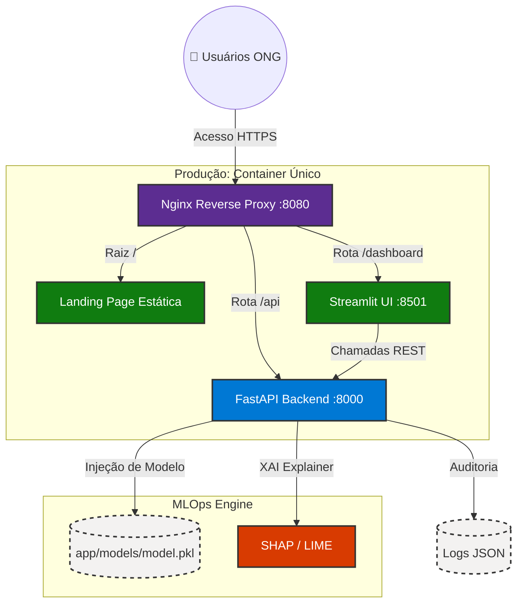
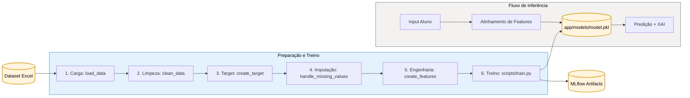

# Projeto Tech Challenge Fase 5

> Esta solução consolida uma arquitetura MLOps completa: inferência assíncrona escalável via FastAPI, orquestração Cloud Native (pronta para K8s), esteira CI/CD rigorosa (GitFlow) e explicabilidade de IA (XAI) para garantir que cada predição do risco de defasagem do aluno é fundamentada e auditável para a Associação Passos Mágicos.

---

## 📌 Índice

- [📝 Sobre o Projeto](#-sobre-o-projeto)
- [🎯 Desafio](#-desafio)
- [🛠 Tecnologias e Ferramentas](#-tecnologias-e-ferramentas)
- [🧱 Arquitetura da Solução](#-arquitetura-da-solução)
- [🗂️ Estrutura de Diretórios](#-estrutura-de-diretórios)
- [🚀 Como Configurar e Executar o Projeto](#-como-configurar-e-executar-o-projeto)
- [✅ Testes e Validações](#-testes-e-validações)
- [🔄 CI/CD Pipeline](#-cicd-pipeline)
- [🤖 IA para Code Review](#-ia-para-code-review)
- [📖 Documentação da API](#-documentação-da-api)
- [📊 Monitoramento e MLflow](#-monitoramento-e-mlflow)
- [🎥 Vídeo Demonstrativo](#-vídeo-demonstrativo)
- [🤝 Desenvolvedores](#-desenvolvedores)
- [⚖️ Licença](#-licença)
- [📚 Documentação Adicional](#-documentação-adicional)
- [🌟 Agradecimentos](#-agradecimentos)

---

## 📝 Sobre o Projeto

Este repositório contém a implementação do **Tech Challenge Fase 5 da Pós-Graduação em Machine Learning**, com foco em **análise e predição do desenvolvimento educacional** de crianças e jovens atendidos pela **Associação Passos Mágicos**.

### 🌟 Associação Passos Mágicos

**Mudando a vida de crianças e jovens por meio da educação.**

A Associação Passos Mágicos possui mais de três décadas de atuação e trabalha na transformação da vida de crianças e jovens em vulnerabilidade social, ampliando suas oportunidades por meio da educação. A iniciativa foi idealizada por **Michelle Flues** e **Dimetri Ivanoff**, com início em **1992**, em **Embu-Guaçu**.

Em **2016**, o programa foi ampliado para alcançar mais jovens, sustentado por quatro pilares:
- ✨ **Educação de qualidade**
- 🧠 **Auxílio psicológico/psicopedagógico**
- 🌍 **Ampliação da visão de mundo**
- 💪 **Protagonismo**

### ✨ Funcionalidades Principais

- **Análise de dados educacionais** com foco em evolução histórica dos alunos.
- **Predição de desempenho** com modelos de Machine Learning.
- **Identificação de padrões** que influenciam o progresso escolar.
- **API REST** para predição, auditoria, monitoramento e ciclo de retreinamento.
- **Dashboard interativo** em Streamlit para visualização e exploração dos dados (com health check de API).
- **Pipeline de treinamento** com estratégia champion/challenger.
- **Monitoramento com MLflow** para métricas, parâmetros e artefatos.
- **Containerização com Docker** para execução padronizada.
- **Deploy no Render** com container único, Nginx e Supervisor.
- **CI/CD com GitHub Actions** em fluxo GitFlow (feature → develop → main).
- **Cobertura de testes** com meta mínima de **85%**.
- **IA para code review** com instruções customizadas de qualidade.

---

## 🎯 Desafio

Com base no dataset de desenvolvimento educacional dos anos **2022, 2023 e 2024**, o projeto propõe um desafio de **Machine Learning Engineering** com impacto social real: antecipar risco de defasagem e apoiar decisões pedagógicas mais assertivas.

---

## 🛠 Tecnologias e Ferramentas

### 🎯 Stack Principal

| Ferramenta | Categoria | Utilização no Projeto |
|------------|-----------|----------------------|
| 🐍 **Python 3.11+** | Linguagem | Base para ML, API e automações |
| ⚡ **FastAPI** | Framework Web | API REST com documentação automática |
| 🎨 **Streamlit** | Dashboard | Interface de análise e operação de modelo |
| 🌐 **Nginx** | Reverse Proxy | Roteamento unificado (`/`, `/api`, `/dashboard`) |

### 🤖 Machine Learning & Ciência de Dados

| Ferramenta | Categoria | Utilização no Projeto |
|------------|-----------|----------------------|
| 📦 **scikit-learn** | ML | Modelo preditivo principal |
| 📊 **NumPy & Pandas** | Dados | Processamento e transformação de dados |
| 📈 **Matplotlib & Seaborn** | Visualização | Gráficos e análises de apoio |
| 🔍 **MLflow** | MLOps | Tracking de experimentos e artefatos |

### 🧪 Qualidade & Testes

| Ferramenta | Categoria | Utilização no Projeto |
|------------|-----------|----------------------|
| 🧪 **Pytest** | Testes | Testes unitários e de integração |
| 🎯 **pytest-cov** | Coverage | Medição e reporte de cobertura |
| ✨ **Ruff** | Lint/Format | Qualidade de código e formatação |
| 🔤 **MyPy** | Type Checking | Verificação de tipos estáticos |

### 🔒 Segurança

| Ferramenta | Categoria | Utilização no Projeto |
|------------|-----------|----------------------|
| 🛡️ **Bandit** | Scanner | Análise de vulnerabilidades Python |
| 🔑 **detect-secrets** | Scanner | Prevenção de vazamento de segredos |

### 🐳 Infraestrutura & DevOps

| Ferramenta | Categoria | Utilização no Projeto |
|------------|-----------|----------------------|
| 🐳 **Docker** | Containerização | Imagem única para execução em produção |
| 🐙 **Docker Compose** | Orquestração local | Execução local simplificada |
| 🏗️ **Render IaC (`render.yaml`)** | Infra as Code | Contrato de deploy e variáveis operacionais |
| 🔄 **GitHub Actions** | CI/CD | Pipelines por branch (feature/develop/main) |
| 🤖 **GitHub Copilot** | IA | Apoio em revisão de código e padronização |

---

## 🧱 Arquitetura da Solução

Arquitetura modular para cobrir o ciclo completo de dados, treino, inferência e operação:
- **Desenvolvimento local**: execução com Docker Compose (porta de entrada única em `http://localhost`).
- **Produção no Render**: container único com **Nginx + FastAPI + Streamlit** sob supervisão do **Supervisor**.

### 1. 🏗️ Arquitetura de Execução



**Roteamento principal via Nginx:**
- `/` → landing page
- `/api/*` → FastAPI
- `/dashboard/*` → Streamlit
- `/health` → health check da API

### 🔄 Pipeline de Dados e ML



### 🎯 Componentes Principais

1. **🌐 Nginx (Reverse Proxy)**: padroniza entrada única e reduz acoplamento entre cliente e serviços internos.
2. **📊 Camada de Dados**: garante limpeza e consistência antes de qualquer inferência.
3. **🛠️ Feature Engineering**: transforma sinais pedagógicos em variáveis úteis ao modelo.
4. **🤖 Camada de Modelo**: mantém ciclo de evolução champion/challenger com rastreabilidade.
5. **⚡ API FastAPI**: expõe endpoints operacionais e auditáveis para integração externa.
6. **🎨 Dashboard Streamlit**: acelera análise funcional por usuários não técnicos.
7. **🔍 Monitoramento com MLflow**: viabiliza comparabilidade entre versões de modelo.
8. **🐳 Infraestrutura Docker**: assegura reprodutibilidade entre desenvolvimento e produção.

---

## 🗂️ Estrutura de Diretórios

Estrutura atual detalhada (principais diretórios e arquivos):

```text
fase-5/
├── .github/                           # Workflows CI/CD e instruções para IA
│   ├── copilot-instructions.md        # Diretrizes de code review
│   ├── copilot-operational-runbook.md # Runbook operacional
│   └── workflows/                     # Pipelines GitHub Actions
│       ├── feature-pipeline.yml       # Pipeline para branches feature/*
│       ├── develop-pipeline.yml       # Pipeline para branch develop
│       ├── main-pipeline.yml          # Pipeline para branch main (produção)
│       └── issue-ops-rollback.yml     # Workflow de rollback emergencial
│
├── app/                               # Aplicação principal (API + Dashboard)
│   ├── main.py                        # FastAPI application (root_path="/api")
│   ├── dashboard.py                   # Entry point do dashboard Streamlit
│   ├── config.py                      # Configurações da aplicação
│   ├── routes/                        # Rotas da API
│   │   ├── predict_route.py           # Endpoint de predição
│   │   ├── train_route.py             # Endpoints de retreinamento (champion/challenger)
│   │   └── audit_route.py             # Endpoints de auditoria e monitoramento
│   ├── models/                        # Artefatos de modelos treinados
│   │   ├── model.pkl                  # Modelo champion em produção
│   │   ├── champion_run_id.txt        # Run ID do modelo em produção
│   │   └── candidate_run_id.txt       # Run ID do modelo candidato
│   ├── dashboard/                     # Módulos do dashboard Streamlit
│   │   ├── config.py                  # Configuração do dashboard
│   │   ├── data.py                    # Funções de carregamento de dados
│   │   ├── sidebar.py                 # Barra lateral do dashboard
│   │   ├── styles.py                  # Estilos CSS customizados
│   │   └── pages/                     # Páginas do dashboard
│   │       ├── prediction.py          # Página de predição
│   │       ├── metrics.py             # Página de métricas
│   │       ├── drift.py               # Página de análise de drift
│   │       ├── retrain.py             # Página de retreinamento
│   │       └── about.py               # Página sobre o projeto
│   ├── utils/                         # Utilitários
│   │   ├── model_loader.py            # Carregamento e validação de modelos
│   │   ├── security.py                # Validação de API key
│   │   ├── structured_logging.py      # Logging estruturado em JSON
│   │   ├── xai.py                     # Explicabilidade (SHAP/LIME)
│   │   └── keep_alive.py              # Keep-alive para Render free tier
│   ├── data/                          # Dados brutos e processados
│   └── artifacts/                     # Artefatos de treinamento
│
├── src/                               # Pipeline de dados e ML
│   ├── data_cleaning.py               # Limpeza e preparação de dados
│   ├── feature_engineering.py         # Engenharia de features
│   ├── feature_store.py               # Armazenamento de features
│   └── model.py                       # Definição e treinamento de modelos
│
├── scripts/                           # Scripts de automação
│   ├── train.py                       # Script principal de treinamento
│   └── monitoring.py                  # Scripts de monitoramento
│
├── tests/                             # Suite completa de testes (85%+ cobertura)
│   ├── conftest.py                    # Fixtures e configuração pytest
│   ├── test_app_config.py             # Testes de configuração da app
│   ├── test_main.py                   # Testes da aplicação FastAPI
│   ├── test_predict_route.py          # Testes do endpoint de predição
│   ├── test_train_route.py            # Testes dos endpoints de retreinamento
│   ├── test_audit_route.py            # Testes dos endpoints de auditoria
│   ├── test_schemas.py                # Testes de validação de schemas
│   ├── test_model_loader.py           # Testes do carregador de modelos
│   ├── test_security.py               # Testes de segurança (API key)
│   ├── test_structured_logging.py     # Testes de logging
│   ├── test_xai_utils.py              # Testes de explicabilidade
│   ├── test_keep_alive.py             # Testes de keep-alive
│   ├── test_data_cleaning.py          # Testes de limpeza de dados
│   ├── test_feature_engineering.py    # Testes de feature engineering
│   ├── test_feature_store.py          # Testes de feature store
│   ├── test_model.py                  # Testes de treinamento de modelo
│   ├── test_dashboard*.py             # Testes do dashboard (múltiplos arquivos)
│   └── test_deployment_config.py      # Testes de configuração de deploy
│
├── notebooks/                         # Notebooks Jupyter para análises
│   ├── data_preprocessing_passos_magicos.ipynb
│   └── DATATHON-PASSOS-MÁGICOS.ipynb
│
├── k8s/                               # Manifestos Kubernetes (opcional)
│   ├── api-deployment.yaml
│   ├── api-service.yaml
│   └── README.md
│
├── htmlcov/                           # Relatórios de cobertura HTML
│
├── docker-compose.yml                 # Orquestração local (desenvolvimento)
├── Dockerfile                         # Imagem Docker de produção
├── nginx.conf                         # Configuração do reverse proxy
├── supervisord.conf                   # Orquestração de processos no container
├── render.yaml                        # IaC para deploy no Render
├── requirements.txt                   # Dependências Python
├── pyproject.toml                     # Configuração de ferramentas Python
├── pytest.ini                         # Configuração do pytest
├── Makefile                           # Comandos de automação
├── DEPLOYMENT.md                      # Guia de deploy
├── TESTING.md                         # Guia de testes
├── TESTING_STRATEGY.md                # Estratégia de testes
├── IMPLEMENTATION_SUMMARY.md          # Resumo de implementação
├── CONTRIBUTING.md                    # Guia de contribuição
└── README.md                          # Este arquivo
```

---

## 🚀 Como Configurar e Executar o Projeto

### Pré-requisitos

- **Python 3.11+**
- **Docker** e **Docker Compose** (opcional)
- **Git**
- **Make** (opcional)

### ✅ Caminho Feliz (Recomendado): Docker Compose

```bash
docker compose up --build

# Em segundo plano
docker compose up -d --build

# Logs
docker compose logs -f

# Encerrar
docker compose down
```

Serviços via `http://localhost`:

| Serviço | URL | Descrição |
|---------|-----|-----------|
| 🏠 Landing Page | `http://localhost/` | Página inicial |
| ⚡ API Docs | `http://localhost/api/docs` | Swagger da API |
| 📊 Dashboard | `http://localhost/dashboard/` | Interface Streamlit |
| ❤️ Health Check | `http://localhost/health` | Saúde da aplicação |

### Opção B: Execução Local (Secundária)

#### 1. Clone e instale dependências

```bash
git clone https://github.com/Fiap-Pos-tech-5MLET/fase-5.git
cd fase-5

python -m venv .venv

# Windows
.venv\Scripts\activate
# Linux/macOS
source .venv/bin/activate

pip install --upgrade pip
pip install -r requirements.txt
```

#### 2. Configure variáveis de ambiente

Para a **Opção B (execução local manual)**, crie o arquivo `.env` na raiz do projeto
(use `.env.example` como base):

```bash
ENVIRONMENT=development
API_URL=http://127.0.0.1:8000
MODEL_PATH=app/models/model.pkl
DATASET_PATH=app/data/raw/BASE DE DADOS PEDE 2024 - DATATHON.xlsx
ARTIFACTS_DIR=app/artifacts
KEEP_ALIVE_INTERVAL=600
MLFLOW_TRACKING_URI=file:./mlruns
API_KEY=troque_para_uma_chave_forte_em_producao
```

Observações rápidas:
- Em Docker Compose, os padrões do projeto já cobrem a maior parte dos cenários locais.
- Em produção no Render (serviço manual sem Blueprint), configure as variáveis no painel
  **Service → Environment**.

#### 3. Prepare os dados

Coloque o dataset em `app/data/raw/` com o nome esperado pelo pipeline.

#### 4. Treine o modelo inicial

```bash
python scripts/train.py
```

Artefatos principais gerados:
- `app/models/model.pkl`
- `app/artifacts/`

#### 5. Execute a API

```bash
uvicorn app.main:app --reload --host 127.0.0.1 --port 8000
```

API local: `http://127.0.0.1:8000`

#### 6. Execute o Dashboard Streamlit

Em outro terminal:

```bash
streamlit run app/dashboard.py --server.port=8501 --server.address=127.0.0.1
```

Dashboard local: `http://127.0.0.1:8501`

---

## ✅ Testes e Validações

O projeto utiliza uma estratégia abrangente de testes automatizados com **meta mínima de 85%** de cobertura, garantindo qualidade e confiabilidade do código.

### 📊 Cobertura de Código

Os testes cobrem os seguintes diretórios principais:

- **`src/`** — Pipeline de dados e ML (data cleaning, feature engineering, feature store, modelo)
- **`app/`** — Aplicação completa (API FastAPI, Dashboard Streamlit, rotas, utilitários)
- **`scripts/`** — Scripts de utilidades (treinamento, monitoramento, processamento, visualização)

### 🧪 Tipos de Testes

A suite de testes está organizada por categorias:

#### 1. Testes de API e Rotas
- **`test_main.py`** — Aplicação FastAPI principal
- **`test_predict_route.py`** — Endpoint de predição e XAI
- **`test_train_route.py`** — Endpoints de retreinamento (champion/challenger)
- **`test_audit_route.py`** — Endpoints de auditoria e monitoramento
- **`test_schemas.py`** — Validação de schemas Pydantic

#### 2. Testes de Pipeline de Dados e ML
- **`test_data_cleaning.py`** — Limpeza e preparação de dados
- **`test_feature_engineering.py`** — Engenharia de features
- **`test_feature_store.py`** — Armazenamento de features
- **`test_model.py`** — Treinamento e validação de modelos

#### 3. Testes de Dashboard
- **`test_dashboard.py`** — Testes gerais do dashboard
- **`test_dashboard_config.py`** — Configuração do dashboard
- **`test_dashboard_data.py`** — Funções de carregamento de dados
- **`test_dashboard_pages.py`** — Páginas do dashboard
- **`test_dashboard_sidebar.py`** — Barra lateral
- **`test_dashboard_styles.py`** — Estilos customizados
- **`test_dashboard_entry.py`** — Entry point e roteamento
- **`test_dashboard_rendering.py`** — Renderização de componentes

#### 4. Testes de Utilitários
- **`test_model_loader.py`** — Carregamento e validação de modelos
- **`test_xai_utils.py`** — Explicabilidade (SHAP/LIME)
- **`test_structured_logging.py`** — Logging estruturado
- **`test_keep_alive.py`** — Keep-alive para Render

#### 5. Testes de Configuração e Infraestrutura
- **`test_app_config.py`** — Configurações da aplicação
- **`test_deployment_config.py`** — Validação de configuração de deploy (render.yaml)

#### 6. Testes de Scripts e Utilitários
- **`test_train.py`** — Script de treinamento e MLflow
- **`test_visualization.py`** — Visualização de gráficos (ROC, importância, etc)
- **`test_monitoring.py`** — Monitoramento de aplicação
- **`test_data_processing.py`** — Processamento de dados em lote
- **`test_eda_analysis.py`** — Análise exploratória de dados
- **`test_datathon_cleaning.py`** — Limpeza específica do datathon
- **`test_notebook_feature_engineering.py`** — Feature engineering em notebooks
- **`test_cleanup_repo.py`** — Limpeza de repositório

### 🏷️ Markers de Testes

Os testes estão organizados com markers pytest para execução seletiva:

```bash
# Apenas testes unitários
pytest -m unit

# Apenas testes de integração
pytest -m integration

# Testes específicos de API
pytest -m api

# Testes de pipeline de dados
pytest -m "data_loading or data_cleaning or feature_engineering"

# Testes do dashboard
pytest -m dashboard
```

**Markers disponíveis:**
- `unit` — Testes unitários para funções/classes individuais
- `integration` — Testes de integração para funcionalidades combinadas
- `api` — Testes de endpoints da API
- `schemas` — Testes de validação de schemas Pydantic
- `dashboard` — Testes do dashboard Streamlit
- `data_loading` — Testes de carregamento de dados
- `data_cleaning` — Testes de limpeza de dados
- `feature_engineering` — Testes de feature engineering
- `model_training` — Testes de treinamento de modelo
- `slow` — Testes que demandam mais tempo
- `gpu` — Testes que requerem GPU (se aplicável)

### 🚀 Executar Testes

#### Execução básica

```bash
# Todos os testes com output verbose
pytest tests/ -v

# Testes com cobertura
pytest tests/ --cov=src --cov=app --cov-report=term-missing -v

# Relatório HTML de cobertura (gerado em htmlcov/)
pytest tests/ --cov=src --cov=app --cov-report=html

# Executar teste específico
pytest tests/test_predict_route.py -v

# Executar testes com palavra-chave
pytest -k "test_predict" -v
```

#### Execução com markers

```bash
# Apenas testes unitários
pytest -m unit -v

# Apenas testes de API
pytest -m api -v

# Testes rápidos (excluindo lentos)
pytest -m "not slow" -v
```

### 🔍 Verificação de Qualidade

O projeto utiliza múltiplas ferramentas para garantir qualidade de código:

```bash
# Formatação automática com Ruff
make format

# Linting (análise estática)
make lint

# Verificação de tipos com MyPy
make type-check

# Análise de segurança (Bandit + detect-secrets)
make security

# Verificação completa de qualidade
make quality
```

### 📈 Relatórios de Cobertura

Após executar os testes com cobertura, os relatórios ficam disponíveis em:

- **Terminal:** resumo com linhas não cobertas
- **HTML:** relatório detalhado em `htmlcov/index.html` (abrir no navegador)

```bash
# Gerar e abrir relatório HTML
pytest tests/ --cov=src --cov=app --cov-report=html
# Windows
start htmlcov/index.html
# Linux/macOS
open htmlcov/index.html
```

### 🧩 Fixtures e Configuração

O arquivo **`tests/conftest.py`** contém:

- Mocks de bibliotecas pesadas (MLflow, Streamlit, Plotly)
- Configuração de paths do projeto
- Fixtures compartilhadas entre testes
- Configuração de markers pytest
- Seed para reprodutibilidade de testes

Esta abordagem garante que os testes executem rapidamente sem dependências externas pesadas.

### 📚 Documentação Adicional

Para informações mais detalhadas sobre estratégias e boas práticas de testes:

- **[TESTING.md](TESTING.md)** — Guia completo de testes e cobertura
- **[TESTING_STRATEGY.md](TESTING_STRATEGY.md)** — Estratégia e arquitetura de testes

---

## 2. 🔄 Esteira CI/CD (Fluxo GitFlow Horizontal)

O projeto adota pipelines GitHub Actions por branch, alinhados ao fluxo GitFlow.

### Workflows ativos

1. **Feature Pipeline** (`feature-pipeline.yml`)
  - Executa em `feature/*` e `bugfix/*`
  - Valida qualidade, testes rápidos e build Docker
  - Pode abrir PR automático para `develop`

2. **Develop Pipeline** (`develop-pipeline.yml`)
  - Executa em `push` na branch `develop`
  - Executa qualidade, testes completos, segurança e build Docker
  - Pode abrir PR de release para `main`

3. **Main Pipeline** (`main-pipeline.yml`)
  - Executa apenas em `push` na branch `main`
  - Valida `render.yaml`, executa smoke tests, build Docker e deploy no Render via deploy hook
  - Executa smoke pós-deploy e rollback automático em falhas

4. **IssueOps Rollback** (`issue-ops-rollback.yml`)
  - Workflow de rollback emergencial acionado por label `ops:rollback` em issue

### 3. 🚑 Gestão de Incidentes e Rollback (Resiliência)

```mermaid
flowchart LR
    classDef incident fill:#ffebee,stroke:#c62828,stroke-width:2px,color:#c62828;
    classDef action fill:#fff3e0,stroke:#f57c00,stroke-width:2px,color:#000;
    classDef automation fill:#e8f5e9,stroke:#2e7d32,stroke-width:2px,color:#000;
    classDef final fill:#f5f5f5,stroke:#424242,stroke-width:2px,color:#000;

    Start((🚨 Incidente)):::incident --> Type{Tipo?}
    Type -- "Código" --> Code[Issue + Label: ops:rollback]:::action
    Code --> IssueOps[Workflow: IssueOps Rollback]:::automation
    IssueOps --> Revert[Git Revert na Main]:::automation

    Type -- "Modelo" --> Model[Editar champion_run_id.txt]:::action

    Revert --> MainPipeline
    Model --> MainPipeline[3. Main Pipeline: Deploy]:::automation
    MainPipeline --> Success([✅ Estabilizado]):::final
    Success --> Hotfix[Criar Branch: hotfix/*]:::action
    Hotfix --> PR[Merge Main e Develop]:::automation
```



### Características

- Logs e summaries detalhados por etapa
- Jobs paralelos para reduzir tempo de execução
- Gating por qualidade/segurança antes de avançar de estágio
- Governança de origem de PR entre branches

---

## 🤖 IA para Code Review

O projeto usa **GitHub Copilot** com instruções customizadas para padronização técnica.

### Padrões verificados

- ✅ Type hints em parâmetros e retornos
- ✅ Docstrings em estilo Google (português)
- ✅ Convenções de nomenclatura e organização de código
- ✅ Regras de segurança (inputs, segredos, erros)
- ✅ Boas práticas de testes e cobertura
- ✅ Protocolo de validação por tipo de mudança (código, scripts, docs e testes)

As diretrizes estão em [.github/copilot-instructions.md](.github/copilot-instructions.md) e
no runbook operacional [.github/copilot-operational-runbook.md](.github/copilot-operational-runbook.md).

---

## 📖 Documentação da API

A API oferece endpoints para predição, auditoria e gestão do ciclo de modelos.

### Documentação interativa

- **Swagger UI (local direto na API):** `http://127.0.0.1:8000/docs`
- **Swagger UI (via Nginx):** `http://localhost/api/docs`
- **ReDoc (local direto na API):** `http://127.0.0.1:8000/redoc`

### Endpoints principais

```http
GET  /health
GET  /
POST /predict
POST /update-data
GET  /model-info
GET  /drift
POST /retrain
POST /promote
POST /discard
GET  /model-metrics
GET  /model-artifact/{name}
```

### Autorização em rotas sensíveis

As rotas de escrita e retreinamento exigem o header `X-API-KEY` com o valor configurado na variável de ambiente `API_KEY`:

- `POST /retrain`
- `POST /promote`
- `POST /discard`

Sem chave válida, a API responde `401 Unauthorized`.

### Ingestão de Dataset (POST /update-data)

O endpoint `/update-data` permite que a ONG envie novos datasets para serem usados no próximo retreinamento.

**Características:**
- ✅ Validação de API Key (governança de acesso)
- ✅ Validação de formato (`.csv` ou `.xlsx`)
- ✅ Versionamento automático com timestamp
- ✅ Logging de auditoria completo
- ✅ Redirecionamento para próximo passo (drift monitor)

**Requisição:**

```bash
curl -X POST \
  'http://localhost/api/update-data' \
  -H 'x-api-key: SUA_CHAVE_API' \
  -F 'file=@dados_2024.xlsx'
```

**Resposta (201 Created):**

```json
{
  "status": "sucesso",
  "mensagem": "Arquivo dados_2024.xlsx atualizado com sucesso.",
  "arquivo_versionado": "dados_2024_20240305_143000.xlsx",
  "timestamp": "20240305_143000",
  "tamanho_bytes": 245632,
  "proximo_passo": "Acesse GET /drift para monitorar degradação e decida se retreino é necessário.",
  "auditoria": {
    "acao": "ingestao_dados",
    "timestamp": "20240305_143000",
    "arquivo": "dados_2024.xlsx"
  }
}
```

**Fluxo pós-ingestão:**
1. Arquivo é salvo com versão: `dados_2024_YYYYMMDD_HHMMSS.xlsx`
2. Arquivo atual sobrescrito: `dados_2024.xlsx`
3. Log gerado para auditoria
4. Usuário redirecionado a `/drift` para monitorar

**Exemplos de exemplo: Requisição via Python**

```python
import requests

files = {'file': open('dados_2024.xlsx', 'rb')}
headers = {'x-api-key': 'SUA_CHAVE_API'}

response = requests.post(
    'http://localhost/api/update-data',
    files=files,
    headers=headers
)

print(response.json())
# {
#   "status": "sucesso",
#   "arquivo_versionado": "dados_2024_20240305_143000.xlsx",
#   ...
# }
```

---

## Exemplo de ingestão via cURL

```bash
curl -X POST \
  'http://localhost/api/predict' \
  -H 'accept: application/json' \
  -H 'x-requested-by: banca_fiap' \
  -H 'Content-Type: application/json' \
  -d '{
  "data": {
    "IDADE": 16,
    "FASE": "Fase 1 (3° e 4° ano)",
    "INDE_22": 6.5,
    "INDE_23": 7.1,
    "ANO_INGRESSO": 2022,
    "GÊNERO": "Feminino"
  }
}'
```

> Se estiver usando Docker com Nginx local, utilize `http://localhost/api/predict`.

### Estratégia Champion/Challenger (rastreabilidade)

- O endpoint `/retrain` gera um **candidato** e grava o `run_id` em `app/models/candidate_run_id.txt`.
- O endpoint `/promote` só promove para produção após validação, copiando o `run_id` para `app/models/champion_run_id.txt`.
- O endpoint `/model-metrics` usa `app/models/champion_run_id.txt` para consultar a run exata no MLflow.

Com isso, apenas modelos validados viram champion, e cada promoção fica auditável por `run_id`.

---

## � Como o Drift Funciona no Projeto

### O que é Data Drift?

**Data Drift** ocorre quando a distribuição estatística dos dados de entrada muda significativamente em relação aos dados usados para treinar o modelo. Em um contexto educacional, isso significa que o **perfil dos alunos** (idade, distribuição de notas, padrões de frequência) está mudando.

**Por que importa?** Um modelo treinado em 2022 com um perfil específico de alunos pode perder acurácia se, em 2024, os novos alunos têm uma distribuição diferente daqueles dados históricos.

### Ferramenta Base: Evidently

No projeto, o cálculo de drift **não é feito "na mão"**. Utilizamos a biblioteca **Evidently**, que é o **padrão ouro do mercado** para observabilidade de modelos:

```python
from evidently.report import Report
from evidently.metric_preset import DataDriftPreset

report = Report(metrics=[DataDriftPreset()])
report.run(reference_data=df_referencia, current_data=df_atual)
```

O **DataDriftPreset** usa testes estatísticos robustos (Kolmogorov-Smirnov, chi-squared, etc.) para cada feature, comparando distribuições empiricamente.

### Fluxo de Execução

1. **Geração do Relatório de Drift**
   - Ao executar `python scripts/monitoring.py` (ou clicar no botão "Gerar Relatório" no Dashboard),ocorre:
     - Carregamento dos **dados brutos** (`app/data/raw/*.xlsx` ou `.csv`)
     - Aplicação das **transformações exatas** usadas no treinamento (`clean_data`, `create_target`, `create_features`)
     - Divisão do dataset em **dados de referência** (usuário pode escolher um ano) e **dados atuais** (ano/período mais recente)

2. **Comparação Estatística**
   - O Evidently compara distribuições de cada feature:
     - Features numéricas: teste KS (distância entre CDFs)
     - Features categóricas: teste chi-squared
     - Threshold padrão: valor p < 0.05 (significância estatística)

3. **Gera Relatório HTML**
   - Visualização interativa da drift por feature
   - Histogramas antes/depois
   - Recomendações automáticas

4. **Exposição Visual e Auditável**
   - Local: `app/artifacts/data_drift_report.html`
   - Via API: `GET /drift` (retorna HTML renderizável)
   - Via Dashboard: página "🔄 Monitoramento de Drift" (renderiza HTML no Streamlit)
   - Acesso: `http://localhost/drift` (Nginx)

### Governança Documentada: Critério de Ação

O critério de **quando retreinar** está documentado no endpoint `/model-info`:

```json
{
  "degradacao_do_modelo": {
    "descricao": "Perfil dos alunos muda significativamente ao longo dos anos",
    "deteccao": "Monitoramento de Data Drift via Evidently. Se > 30% das features apresentarem drift estatístico, disparar alerta.",
    "acao": "Retreinar o modelo com os dados mais recentes."
  }
}
```

**Simples:** Se **mais de 30% das variáveis** sofrem drift estatístico, é sinal de que o modelo precisa ser retreinado.

### Fluxo Operacional de Decisão

```
┌─────────────────────────────────────────────────────────────┐
│ 1. ONG carrega novo dataset via endpoint POST /update-data  │
└────────────────────┬────────────────────────────────────────┘
                     │
                     ▼
┌─────────────────────────────────────────────────────────────┐
│ 2. Dashboard/Operador acessa /drift                         │
│    → Evidently gera relatório de dados brutos vs hist.     │
└────────────────────┬────────────────────────────────────────┘
                     │
              ┌──────┴──────┐
              │             │
         Sem Drift    Com Drift (>30%)
              │             │
              ▼             ▼
         ✅ Sem ação   ⚠️ Decisão:
                       Retreinar?
                           │
                      ┌────┴────┐
                      │         │
                    Sim       Não
                      │       (Monitorar)
                      ▼
            3. POST /retrain
               (criar candidato)
                      │
                      ▼
            4. Validar métricas
               (POST /promote ou /discard)
                      │
                      ▼
            ✅ Champion atualizado
```

### Exemplo Prático: Executar Drift Detection

**Via Python:**

```python
from scripts.monitoring import generate_drift_report

# Gera relatório Evidently
report_path = "app/artifacts/data_drift_report.html"
generate_drift_report(
    data_path="app/data/raw/PEDE_PASSOS_DATASET_FIAP.csv",
    report_path=report_path
)

print(f"Relatório em: {report_path}")
```

**Via Dashboard:**
1. Acesse `http://localhost/dashboard/`
2. Navegue para "🔄 Monitoramento de Drift"
3. Clique em "🔄 Gerar Relatório"
4. Visualize histogramas e recomendações

**Via API (REST):**

```bash
curl -X GET \
  'http://localhost/api/drift' \
  -H 'accept: text/html'
```

Retorna HTML renderizável no navegador.

### Transparência: Logs de Auditoria

Toda execução de drift (geração, acesso) gera logs estruturados em JSON:

```json
{
  "event": "audit_drift_report_served",
  "timestamp": "2024-03-05T14:30:00",
  "requested_by": "operador_ong",
  "report_path": "app/artifacts/data_drift_report.html"
}
```

Logs auxiliam em auditorias futuras (quem acessou drift, quando, por quê).

---

## �📊 Monitoramento e MLflow

O projeto utiliza **MLflow** para rastrear experimentos, parâmetros, métricas e artefatos de treinamento.

### Como acessar

**Execução local (manual):**

```bash
mlflow ui --port 5000
```

MLflow local: `http://127.0.0.1:5000`

> Em produção no Render, o foco principal é API + Dashboard. O uso de MLflow na nuvem depende do perfil de recursos e da configuração do ambiente.

### Racional de segurança e recursos em produção

No deploy de produção, o serviço de MLflow foi desativado para reduzir consumo de memória/CPU e evitar pressão de recursos no container principal (API + Dashboard + Nginx). O roteamento permanece centralizado no Nginx (`nginx.conf`) e a execução de processos é controlada pelo Supervisor (`supervisord.conf`), onde o bloco do MLflow fica desabilitado por padrão.

### Métricas rastreadas

- Acurácia, precisão, recall e F1-score
- Curvas e artefatos de avaliação
- Hiperparâmetros de treinamento
- Metadados de execução e versionamento de modelo

---

## 🎥 Vídeo Demonstrativo

Assista ao vídeo explicativo do projeto e de seu funcionamento:

- 📹 **Link do vídeo:** [Em breve]
- 💎 **API pública:** [datathon-machine-learning-engineering](https://datathon-machine-learning-engineering.onrender.com/)
- 📊 **Conteúdo:** arquitetura, API, pipeline de treinamento e resultados

### 📸 Screenshots da Aplicação

**Principais interfaces:**
- 🏠 Landing Page
- 📊 Dashboard Streamlit
- 📖 Swagger da API
- 🔍 Indicadores e artefatos de monitoramento

#### Landing Page

> Adicione aqui o screenshot atualizado da landing page quando disponível.

---

## 🤝 Desenvolvedores

Este projeto foi desenvolvido como parte do **Tech Challenge Fase 5** da **Pós-Graduação em Machine Learning Engineering da FIAP**.

**Equipe 5MLET:**

| Nome | RM | GitHub |
|------|-----|--------|
| Lucas Felipe de Jesus Machado | RM364306 | [@lfjmachado](https://github.com/lfjmachado) |
| Antônio Teixeira Santana Neto | RM364480 | [@antonioteixeirasn](https://github.com/antonioteixeirasn) |
| Gabriela Moreno Rocha dos Santos | RM364538 | [@gabrielaMSantos](https://github.com/gabrielaMSantos) |
| Erik Douglas Alves Gomes | RM364379 | [@Erik-DAG](https://github.com/Erik-DAG) |
| Leonardo Fernandes Soares | RM364648 | [@leferso](https://github.com/leferso) |

---

## ⚖️ Licença

Este projeto está licenciado sob a **Licença MIT**. Consulte o arquivo [LICENSE](LICENSE) para mais detalhes.

---

## 📚 Documentação Adicional

### Guias de testes e qualidade

- **[TESTING.md](TESTING.md)** — Guia completo de testes e cobertura
- **[TESTING_STRATEGY.md](TESTING_STRATEGY.md)** — Estratégia de testes do projeto
- **[IMPLEMENTATION_SUMMARY.md](IMPLEMENTATION_SUMMARY.md)** — Resumo de implementação

### Guias de desenvolvimento e operação

- **[CONTRIBUTING.md](CONTRIBUTING.md)** — Guia de contribuição
- **[DEPLOYMENT.md](DEPLOYMENT.md)** — Guia de deploy
- **[.github/copilot-instructions.md](.github/copilot-instructions.md)** — Diretrizes de code review com IA
- **[.github/copilot-operational-runbook.md](.github/copilot-operational-runbook.md)** — Runbook de validação e troubleshooting operacional

---

## 🌟 Agradecimentos

- **FIAP** — Pela estrutura e qualidade da pós-graduação.
- **Professores** — Pelo conhecimento compartilhado e orientação.
- **Associação Passos Mágicos** — Pelos dados e pela inspiração para um projeto com impacto social por meio da educação.

---