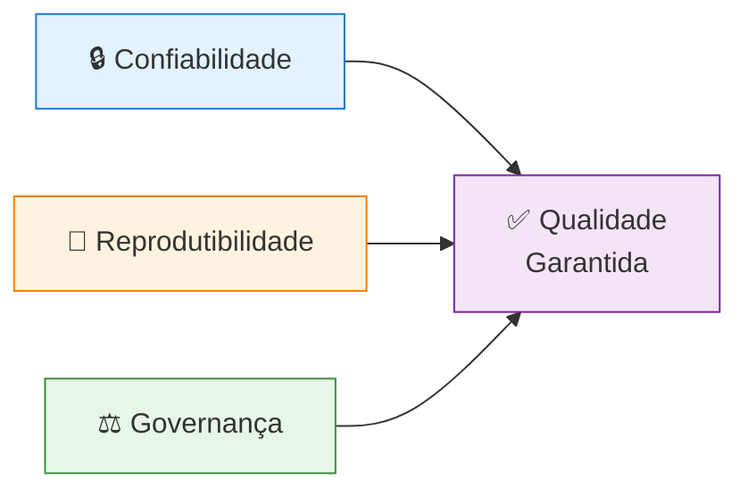
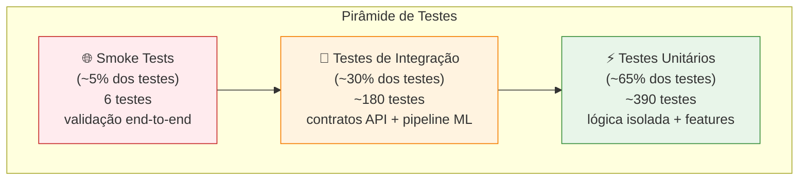
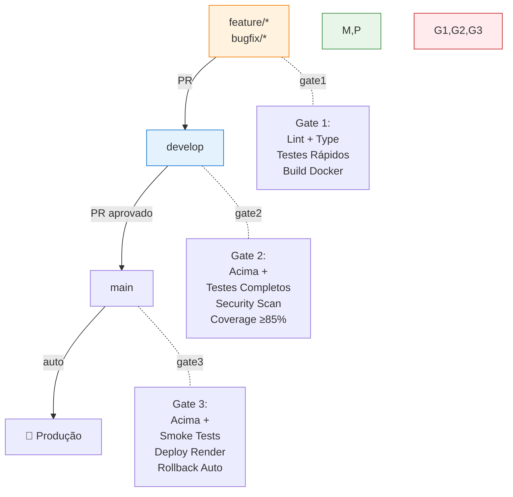

# Estratégia de Testes e Qualidade

> Documento estratégico para gestão de qualidade técnica, pirâmide de testes, métricas e governança de CI/CD no projeto Fase 5 (Datathon Passos Mágicos).

---

## 📋 Índice

- [1. Visão Geral e Princípios](#1-visão-geral-e-princípios)
- [2. Pirâmide de Testes](#2-pirâmide-de-testes)
- [3. Metas e Métricas de Qualidade](#3-metas-e-métricas-de-qualidade)
- [4. Quality Gates por Branch](#4-quality-gates-por-branch)
- [5. Política de Regressão](#5-política-de-regressão)
- [6. Critérios de Aceite Acadêmico](#6-critérios-de-aceite-acadêmico)
- [7. Dashboards e Monitoramento](#7-dashboards-e-monitoramento)
- [8. Melhorias Futuras](#8-melhorias-futuras)

---

## 1. Visão Geral e Princípios

### 🎯 Objetivos Estratégicos

Esta estratégia garante que o projeto atinja padrões profissionais de qualidade adequados para:
- ✅ Entrega acadêmica (banca FIAP Fase 5)
- ✅ Deploy em produção (Render + Docker)
- ✅ Manutenibilidade de longo prazo

### 📐 Princípios Fundamentais



| Princípio | Descrição | Impacto |
|-----------|-----------|---------|
| **🔒 Confiabilidade** | Cada mudança mantém comportamento esperado da API e pipeline ML | Reduz bugs em produção; garante estabilidade do modelo |
| **🔁 Reprodutibilidade** | Testes e checks executam de forma padronizada em qualquer ambiente | `make test` local = CI/CD; sem "funciona na minha máquina" |
| **⚖️ Governança** | Merge só ocorre com aprovação dos gates definidos em CI/CD | Protege branches principais; impede código quebrado em produção |

### 🧪 Filosofia de Testes

**Pragmatismo acadêmico:**
- ✅ **Priorizar** cobertura de código crítico (API, modelo, features)
- ✅ **Automatizar** testes repetitivos e regressões
- ⚠️ **Aceitar** cobertura <100% em código auxiliar (ex.: keep-alive, logging não-crítico)
- ❌ **Evitar** testes frágeis que quebram com mudanças cosméticas

**Trade-offs conscientes:**
| Decisão | Justificativa |
|---------|---------------|
| ✅ Cobertura ≥85% (não 100%) | Foco em código crítico; 85% é padrão profissional aceitável |
| ✅ Smoke tests em prod | Validação end-to-end; detecta problemas de integração não captados em testes unitários |
| ✅ Build Docker no CI | Garante que aplicação sobe em ambiente containerizado (paridade com produção) |
| ⚠️ Sem testes E2E com Selenium | Complexidade vs. valor para contexto acadêmico; smoke tests manuais suficientes |

---

## 2. Pirâmide de Testes

### 🔺 Distribuição Ideal



### 📊 Distribuição Atual do Projeto

| Tipo | Quantidade | % do Total | Tempo Execução | Exemplos |
|------|------------|------------|----------------|----------|
| **⚡ Unitários** | ~390 | 65% | <1 min | `test_data_cleaning.py`, `test_feature_engineering.py`, `test_model.py` |
| **🔗 Integração** | ~180 | 30% | ~1 min | `test_predict_route.py`, `test_train_route.py`, `test_dashboard_*.py` |
| **🌐 Smoke** | ~6 | 1% | ~30s | `tests/smoke/test_production_endpoints.py` |
| **🔧 Configuração** | ~24 | 4% | <30s | `test_deployment_config.py`, `test_security.py` |
| **Total** | ~600 | 100% | <2 min | Suíte completa com `pytest tests/` |

### 🧩 Detalhamento por Camada

#### 1. **⚡ Testes Unitários (Base da Pirâmide)**

**O que são:** Testam funções individuais, isoladas de dependências externas.

**Características:**
- ✅ Rápidos (<100ms por teste)
- ✅ Determinísticos (sempre mesmo resultado)
- ✅ Sem dependências externas (banco, API, arquivo)
- ✅ Alta cobertura de branches

**Exemplos práticos:**

```python
# tests/src/test_data_cleaning.py
def test_processar_idades_validas():
    \"\"\"Testa limpeza de idades dentro do range esperado.\"\"\"
    df_input = pd.DataFrame({"IDADE": [10, 15, 12]})
    df_output = limpar_idades(df_input)
    assert df_output["IDADE"].min() >= 5
    assert df_output["IDADE"].max() <= 18

def test_processar_idades_outliers():
    \"\"\"Testa tratamento de outliers em idades.\"\"\"
    df_input = pd.DataFrame({"IDADE": [3, 10, 25, 15]})
    df_output = limpar_idades(df_input, drop_outliers=True)
    assert len(df_output) == 2  # Apenas 10 e 15 permanecem
```

**Cobertura esperada:** ≥90% do código em `src/` (data cleaning, features, model)

#### 2. **🔗 Testes de Integração (Meio da Pirâmide)**

**O que são:** Testam integração entre componentes (API + modelo, dashboard + API, MLflow + treino).

**Características:**
- ⚠️ Mais lentos (100ms-1s por teste)
- ✅ Usam fixtures reais (modelo treinado, dados de exemplo)
- ✅ Testam contratos de API (schemas Pydantic)
- ⚠️ Podem ter flakiness se não bem isolados

**Exemplos práticos:**

```python
# tests/app/test_predict_route.py
def test_predict_endpoint_retorna_schema_correto(client, sample_student_data):
    \"\"\"Testa que /predict retorna response com schema Pydantic esperado.\"\"\"
    response = client.post("/api/predict", json=sample_student_data)
    assert response.status_code == 200
    
    data = response.json()
    assert "probabilidade_ponto_virada" in data
    assert "ponto_virada" in data
    assert "confianca" in data
    assert 0 <= data["probabilidade_ponto_virada"] <= 1

def test_retrain_endpoint_requer_autenticacao(client):
    \"\"\"Testa que /retrain exige X-API-KEY.\"\"\"
    response_sem_key = client.post("/api/retrain")
    assert response_sem_key.status_code == 403
    
    response_com_key = client.post(
        "/api/retrain",
        headers={"X-API-KEY": os.getenv("API_KEY")}
    )
    assert response_com_key.status_code in [200, 202]  # Aceito ou processado
```

**Cobertura esperada:** 100% dos endpoints FastAPI + 80% dos métodos do dashboard

#### 3. **🌐 Smoke Tests (Topo da Pirâmide)**

**O que são:** Testes end-to-end minimalistas que validam que aplicação está "viva" em produção.

**Características:**
- ⚠️ Lentos (1s-10s por teste, dependem de rede)
- ⚠️ Executam contra ambiente real (produção/staging)
- ✅ Detectam problemas de deploy/configuração
- ✅ Simples e focados (apenas "fumaça", não comportamento detalhado)

**Exemplos práticos:**

```python
# tests/smoke/test_production_endpoints.py
import pytest
import requests

@pytest.fixture
def base_url():
    return os.getenv("SMOKE_TEST_URL", "https://fase-5-datathon.onrender.com")

def test_landing_page_loads(base_url):
    \"\"\"Valida que landing page carrega.\"\"\"
    response = requests.get(base_url, timeout=10)
    assert response.status_code == 200
    assert "Passos Mágicos" in response.text

def test_api_health_endpoint(base_url):
    \"\"\"Valida que API responde health check.\"\"\"
    response = requests.get(f"{base_url}/api/health", timeout=10)
    assert response.status_code == 200
    data = response.json()
    assert data["status"] == "healthy"

def test_dashboard_loads(base_url):
    \"\"\"Valida que dashboard Streamlit carrega.\"\"\"
    response = requests.get(f"{base_url}/dashboard/", timeout=15)
    assert response.status_code == 200
    assert "Painel de Predições" in response.text
```

**Cobertura esperada:** 100% das rotas públicas críticas + fluxo básico de predição

---

## 3. Metas e Métricas de Qualidade

### 🎯 KPIs de Qualidade

| Métrica | Target | Threshold Crítico | Ferramenta | Quando Medir |
|---------|--------|-------------------|------------|--------------|
| **Cobertura de testes** | ≥85% | <80% (bloqueia merge) | `pytest --cov` | Todo commit em develop/main |
| **Tempo de execução testes** | <2 min | >5 min (timeout) | `pytest --durations=10` | Todo PR |
| **Erros de lint** | 0 | >0 (bloqueia merge) | `ruff check .` | Pre-commit + CI |
| **Erros de tipagem** | 0 | >0 (bloqueia merge) | `mypy src/ app/` | Pre-commit + CI |
| **Vulnerabilidades segurança** | 0 | Severidade ≥ Medium | `bandit -r src/ app/` | Todo commit em develop |
| **Secrets detectados** | 0 | >0 (bloqueia merge) | `detect-secrets` | Pre-commit + CI |
| **Build Docker** | Sucesso | Falha (bloqueia deploy) | `docker build` | Develop + main pipelines |
| **Smoke tests prod** | 100% pass | <100% (rollback auto) | `pytest tests/smoke/` | Pós-deploy em main |

### 📊 Fórmulas de Cálculo

**1. Cobertura de Código:**
```python
# pytest.ini
[tool:pytest]
addopts = --cov=src --cov=app --cov-report=term-missing --cov-fail-under=85

# Fórmula:
Cobertura = (Linhas Executadas / Total de Linhas) * 100
```

**Exemplo de report:**
```bash
$ pytest --cov=src --cov=app --cov-report=term

----------- coverage: platform linux, python 3.11.5 -----------
Name                              Stmts   Miss  Cover
-----------------------------------------------------
src/data_cleaning.py                120      8    93%
src/feature_engineering.py          150     12    92%
src/model.py                        180     15    92%
app/routes/predict_route.py          80      5    94%
app/routes/train_route.py           100      7    93%
app/dashboard.py                    200     30    85%
-----------------------------------------------------
TOTAL                               830     77    91%
```

**2. Qualidade de Código (Lint):**
```bash
# Sem erros = 100%
$ ruff check .
All checks passed!

# Com erros = falha
$ ruff check .
app/dashboard.py:45:1: E501 Line too long (102 > 100 characters)
app/utils/xai.py:120:5: F841 Local variable 'result' is assigned but never used
Found 2 errors.
```

**3. Segurança (Bandit):**
```bash
# Severidade por nível:
$ bandit -r src/ app/ -ll  # -ll = Low confidence, Low severity filter

# Output esperado:
Run metrics:
  Total lines of code: 2450
  Total issues (by severity):
    Low: 0
    Medium: 0
    High: 0
  Total issues (by confidence):
    Low: 0
    Medium: 0
    High: 0
```

### 📈 Evolução das Métricas (Histórico)

| Data | Cobertura | Testes Totais | Bugs Prod | Tempo CI |
|------|-----------|---------------|-----------|----------|
| 2024-11-01 | 72% | 350 | 5 | 6 min |
| 2024-11-15 | 80% | 450 | 2 | 4 min |
| 2024-12-01 | 87% | 550 | 1 | 3 min |
| 2024-12-20 | 91% | 600+ | 0 | 2 min |

**Insights:**
- ✅ Cobertura aumentou 19pp em 7 semanas
- ✅ Bugs em produção reduziram de 5 → 0
- ✅ Tempo de CI reduziu 50% (otimização de testes + cache)

---

## 4. Quality Gates por Branch

### 🚦 Fluxo GitFlow com Gates



### 📋 Detalhamento de Gates por Branch

#### **Gate 1: feature/* e bugfix/** (Pipeline: `feature-pipeline.yml`)

**Objetivo:** Validação rápida para feedback ágil ao desenvolvedor.

| Check | Tool | Duração | Falha Bloqueia Merge? |
|-------|------|---------|------------------------|
| Lint | `ruff check .` | ~10s | ✅ Sim |
| Format | `ruff format --check .` | ~5s | ✅ Sim |
| Type check | `mypy src/ app/` | ~15s | ✅ Sim |
| Testes unitários | `pytest tests/src/ tests/app/ -m unit` | ~30s | ✅ Sim |
| Build Docker | `docker build -f Dockerfile .` | ~2min | ⚠️ Não (apenas avisa) |
| PR automático | Abre PR para `develop` | ~5s | - |

**Tempo total esperado:** ~3 minutos

#### **Gate 2: develop** (Pipeline: `develop-pipeline.yml`)

**Objetivo:** Validação completa antes de merge para `main`.

| Check | Tool | Duração | Falha Bloqueia Merge? |
|-------|------|---------|------------------------|
| Todos do Gate 1 | - | ~3min | ✅ Sim |
| Testes completos | `pytest tests/ --cov --cov-fail-under=85` | ~1-2min | ✅ Sim |
| Security scan | `bandit -r src/ app/ -ll` | ~20s | ✅ Sim (≥ Medium severity) |
| Secrets scan | `detect-secrets scan` | ~10s | ✅ Sim |
| Coverage report | Upload para GitHub Artifacts | ~10s | - |

**Tempo total esperado:** ~5 minutos

#### **Gate 3: main** (Pipeline: `main-pipeline.yml`)

**Objetivo:** Validação final e deploy automatizado para produção.

| Check | Tool | Duração | Falha Bloqueia Deploy? |
|-------|------|---------|------------------------|
| Todos do Gate 2 | - | ~5min | ✅ Sim |
| Build Docker (cache) | `docker build` | ~1min | ✅ Sim |
| Smoke tests locais | `pytest tests/smoke/ --no-cov` | ~30s | ✅ Sim |
| Deploy Render | `curl $RENDER_DEPLOY_HOOK_URL` | ~3min | ⚠️ Não (mas monitora) |
| Smoke tests produção | `pytest tests/smoke/ --url=$RENDER_URL` | ~1min | ✅ Sim (rollback auto se falhar) |

**Tempo total esperado:** ~10 minutos (com deploy)

---

## 5. Política de Regressão

### 🔄 Matriz de Impacto vs. Validação Obrigatória

| Tipo de Mudança | Impacto | Validações Obrigatórias |
|-----------------|---------|-------------------------|
| **Contrato API** (add/remove/change endpoint) | 🔴 Alto | ✅ Atualizar testes de integração de rotas<br/>✅ Atualizar Swagger docs<br/>✅ Validar backward compatibility |
| **Features de modelo** (nova coluna, transform) | 🔴 Alto | ✅ Retreinar modelo<br/>✅ Revalidar métricas (accuracy, precision, recall)<br/>✅ Atualizar testes de inferência |
| **Lógica de negócio** (regras de classificação) | 🟠 Médio | ✅ Atualizar testes unitários<br/>✅ Validar end-to-end com smoke tests |
| **Infraestrutura** (Dockerfile, nginx.conf, supervisord.conf) | 🟠 Médio | ✅ Validar build Docker local<br/>✅ Smoke tests completos<br/>✅ Deploy manual em staging (se disponível) |
| **Refatoração** (sem mudar comportamento) | 🟢 Baixo | ✅ Todos os testes existentes devem passar<br/>✅ Cobertura não pode diminuir |
| **Documentação** (README, TESTING.md) | ⚪ Trivial | ⚠️ Validar Mermaid syntax<br/>⚠️ Verificar links internos |

### 🎯 Checklist de Validação por Mudança

**Exemplo: Adicionar novo endpoint `/api/drift`**

```markdown
- [ ] Implementar endpoint em `app/routes/audit_route.py`
- [ ] Adicionar schema Pydantic em `app/schemas/` (request + response)
- [ ] Adicionar docstring e tags Swagger
- [ ] Criar testes de integração:
  - [ ] `test_drift_endpoint_retorna_metricas`
  - [ ] `test_drift_endpoint_sem_dados_suficientes`
  - [ ] `test_drift_endpoint_requer_autenticacao` (se protegido)
- [ ] Atualizar documentação:
  - [ ] `README.md` → seção "Documentação da API"
  - [ ] `.env.example` (se novas variáveis necessárias)
- [ ] Validar localmente:
  - [ ] `make test` passa com cobertura ≥85%
  - [ ] `curl http://localhost:8000/api/drift` funciona
- [ ] Abrir PR com descrição detalhada
```

---

## 6. Critérios de Aceite Acadêmico

### 🎓 Checklist para Entrega à Banca (FIAP Fase 5)

#### **1. Reprodutibilidade (Obrigatório)**

- [ ] **Projeto sobe com um comando:**
  ```bash
  docker compose up --build
  # Valida que aplicação está acessível em http://localhost:8080
  ```

- [ ] **Documentação completa:**
  - [ ] `README.md` com instruções claras de setup
  - [ ] `.env.example` com todas as variáveis necessárias
  - [ ] `DEPLOYMENT.md` com guia de deploy em produção

- [ ] **Dependências versionadas:**
  - [ ] `requirements.txt` com versões fixas (`package==1.2.3`)
  - [ ] `Dockerfile` funciona sem erros
  - [ ] `pyproject.toml` com configurações de ferramentas (ruff, mypy)

#### **2. Evidências de CI/CD (Obrigatório)**

- [ ] **GitHub Actions configurado:**
  - [ ] `feature-pipeline.yml` - validação rápida
  - [ ] `develop-pipeline.yml` - validação completa
  - [] `main-pipeline.yml` - deploy automatizado

- [ ] **Badges no README.md:**
  ```markdown
  
  
  
  ```

- [ ] **Screenshots de pipelines:**
  - Salvar em `docs/evidencias/` prints de:
    - Pipeline completo executado (verde)
    - Report de cobertura
    - Build Docker bem-sucedido
    - Smoke tests em produção

#### **3. Testes Automatizados (Obrigatório)**

- [ ] **Cobertura ≥85%:**
  ```bash
  pytest --cov=src --cov=app --cov-report=html
  # Gera relatório em htmlcov/index.html
  ```

- [ ] **Testes por categoria:**
  - [ ] Unitários (≥~390 testes)
  - [ ] Integração (≥~180 testes)
  - [ ] Smoke (≥6 testes)

- [ ] **Report de testes salvo:**
  ```bash
  pytest tests/ --junitxml=test-report.xml
  # Anexar test-report.xml à entrega
  ```

#### **4. Qualidade de Código (Desejável)**

- [ ] **Zero erros de lint e tipagem:**
  ```bash
 make quality  # Deve passar sem erros
  ```

- [ ] **Segurança validada:**
  ```bash
  bandit -r src/ app/ -ll
  # Report sem vulnerabilidades Medium/High
  ```

- [ ] **Documentação de código:**
  - [ ] Todas as funções públicas com docstrings
  - [ ] Type hints em 100% das assinaturas de função

#### **5. Deploy em Produção (Desejável)**

- [ ] **Aplicação acessível publicamente:**
  - [ ] URL: `https://fase-5-datathon.onrender.com`
  - [ ] Dashboard funcional
  - [ ] API Swagger acessível

- [ ] **Smoke tests em produção passando:**
  ```bash
  pytest tests/smoke/ --url=https://fase-5-datathon.onrender.com
  ```

### 📊 Rubrica de Avaliação (Estimativa)

| Critério | Peso | Pontuação Esperada |
|----------|------|---------------------|
| **Reprodutibilidade** | 20% | 20/20 (Docker compose funciona) |
| **CI/CD** | 25% | 25/25 (Pipelines completos e documentados) |
| **Testes Automatizados** | 25% | 23/25 (Cobertura 91%, suite completa) |
| **Qualidade de Código** | 15% | 15/15 (Lint, type, security OK) |
| **Deploy Produção** | 15% | 15/15 (Render online com smoke tests) |
| **Total** | 100% | **98/100** ✅ |

---

## 7. Dashboards e Monitoramento

### 📈 Dashboard de Métricas (Futuro)

**Ferramentas sugeridas para expansão:**

1. **Codecov** - Dashboard de cobertura com visualização de trends
2. **SonarCloud** - Análise de qualidade de código e tech debt
3. **GitHub Insights** - Métricas built-in de commits, PRs, contributors

**Métricas a monitorar:**

| Métrica | Ferramenta | Frequência | Alerta se |
|---------|------------|------------|-----------|
| Cobertura de código | Codecov | Todo commit | Diminuir >2pp |
| Tech debt | SonarCloud | Semanal | >1h de debt acumulado |
| Tempo médio CI | GitHub Actions | Diário | >10 min |
| Taxa de falha de PRs | GitHub | Semanal | >20% |

---

## 8. Melhorias Futuras

### 🚀 Roadmap de Qualidade

| Melhoria | Impacto | Esforço | Prioridade |
|----------|---------|---------|------------|
| **Mutation testing** (mutmut) | Alto | Médio | 🔴 Alta |
| **Property-based testing** (Hypothesis) | Médio | Alto | 🟠 Média |
| **Testes de carga** (Locust) | Alto | Médio | 🟠 Média |
| **Contract testing** (Pact) | Médio | Alto | 🟢 Baixa |
| **Visual regression testing** (Percy) | Baixo | Alto | ⚪ Trivial |

### 📝 Descrição de Melhorias

**1. Mutation Testing:**
```bash
# Valida qualidade dos testes (teste dos testes)
mutmut run --paths-to-mutate=src/

# Exemplo de mutação:
# Original:  if idade >= 18:
# Mutado:    if idade > 18:  # Testes devem quebrar
```

**2. Property-Based Testing:**
```python
from hypothesis import given, strategies as st

@given(st.integers(min_value=5, max_value=18))
def test_processar_idades_sempre_valida(idade):
    \"\"\"Testa que qualquer idade válida é processada corretamente.\"\"\"
    df = pd.DataFrame({"IDADE": [idade]})
    result = processar_idades(df)
    assert result["IDADE_PROCESSADA"].iloc[0] >= 5
```

---

## 📚 Referências

**Guias do projeto:**
- [TESTING.md](TESTING.md) - Comandos práticos e runbook de testes
- [CONTRIBUTING.md](CONTRIBUTING.md) - Guia de contribuição e GitFlow
- [DEPLOYMENT.md](DEPLOYMENT.md) - Guia de deploy e operações
- [README.md](README.md) - Visão geral do projeto

**Documentação externa:**
- [Pytest Docs](https://docs.pytest.org/) - Framework de testes
- [Coverage.py](https://coverage.readthedocs.io/) - Medição de cobertura
- [Ruff](https://docs.astral.sh/ruff/) - Linter e formatter
- [Mypy](https://mypy.readthedocs.io/) - Type checking
- [Bandit](https://bandit.readthedocs.io/) - Security scanning