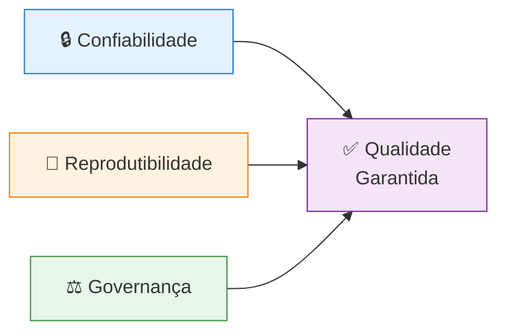
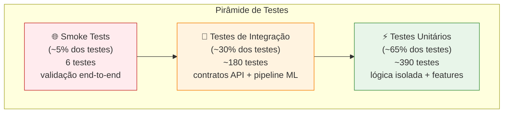

# Estratégia de Testes e Qualidade

> Documento estratégico para gestão de qualidade técnica, pirâmide de testes, métricas e governança de CI/CD no projeto Fase 5 (Datathon Passos Mágicos).

---

## 📋 Índice

- [1. Visão Geral e Princípios](#1-visão-geral-e-princípios)
- [2. Pirâmide de Testes](#2-pirâmide-de-testes)
- [3. Metas e Métricas de Qualidade](#3-metas-e-métricas-de-qualidade)
- [4. Quality Gates por Branch](#4-quality-gates-por-branch)
- [5. Política de Regressão](#5-política-de-regressão)
- [6. Critérios de Aceite Acadêmico](#6-critérios-de-aceite-acadêmico)
- [7. Dashboards e Monitoramento](#7-dashboards-e-monitoramento)
- [8. Melhorias Futuras](#8-melhorias-futuras)

---

## 1. Visão Geral e Princípios

### 🎯 Objetivos Estratégicos

Esta estratégia garante que o projeto atinja padrões profissionais de qualidade adequados para:
- ✅ Entrega acadêmica (banca FIAP Fase 5)
- ✅ Deploy em produção (Render + Docker)
- ✅ Manutenibilidade de longo prazo

### 📐 Princípios Fundamentais



| Princípio | Descrição | Impacto |
|-----------|-----------|---------|
| **🔒 Confiabilidade** | Cada mudança mantém comportamento esperado da API e pipeline ML | Reduz bugs em produção; garante estabilidade do modelo |
| **🔁 Reprodutibilidade** | Testes e checks executam de forma padronizada em qualquer ambiente | `make test` local = CI/CD; sem "funciona na minha máquina" |
| **⚖️ Governança** | Merge só ocorre com aprovação dos gates definidos em CI/CD | Protege branches principais; impede código quebrado em produção |

### 🧪 Filosofia de Testes

**Pragmatismo acadêmico:**
- ✅ **Priorizar** cobertura de código crítico (API, modelo, features)
- ✅ **Automatizar** testes repetitivos e regressões
- ⚠️ **Aceitar** cobertura <100% em código auxiliar (ex.: keep-alive, logging não-crítico)
- ❌ **Evitar** testes frágeis que quebram com mudanças cosméticas

**Trade-offs conscientes:**
| Decisão | Justificativa |
|---------|---------------|
| ✅ Cobertura ≥85% (não 100%) | Foco em código crítico; 85% é padrão profissional aceitável |
| ✅ Smoke tests em prod | Validação end-to-end; detecta problemas de integração não captados em testes unitários |
| ✅ Build Docker no CI | Garante que aplicação sobe em ambiente containerizado (paridade com produção) |
| ⚠️ Sem testes E2E com Selenium | Complexidade vs. valor para contexto acadêmico; smoke tests manuais suficientes |

---

## 2. Pirâmide de Testes

### 🔺 Distribuição Ideal



### 📊 Distribuição Atual do Projeto

| Tipo | Quantidade | % do Total | Tempo Execução | Exemplos |
|------|------------|------------|----------------|----------|
| **⚡ Unitários** | ~390 | 65% | <1 min | `test_data_cleaning.py`, `test_feature_engineering.py`, `test_model.py` |
| **🔗 Integração** | ~180 | 30% | ~1 min | `test_predict_route.py`, `test_train_route.py`, `test_dashboard_*.py` |
| **🌐 Smoke** | ~6 | 1% | ~30s | `tests/smoke/test_production_endpoints.py` |
| **🔧 Configuração** | ~24 | 4% | <30s | `test_deployment_config.py`, `test_security.py` |
| **Total** | ~600 | 100% | <2 min | Suíte completa com `pytest tests/` |

### 🧩 Detalhamento por Camada

#### 1. **⚡ Testes Unitários (Base da Pirâmide)**

**O que são:** Testam funções individuais, isoladas de dependências externas.

**Características:**
- ✅ Rápidos (<100ms por teste)
- ✅ Determinísticos (sempre mesmo resultado)
- ✅ Sem dependências externas (banco, API, arquivo)
- ✅ Alta cobertura de branches

**Exemplos práticos:**

```python
# tests/src/test_data_cleaning.py
def test_processar_idades_validas():
    \"\"\"Testa limpeza de idades dentro do range esperado.\"\"\"
    df_input = pd.DataFrame({"IDADE": [10, 15, 12]})
    df_output = limpar_idades(df_input)
    assert df_output["IDADE"].min() >= 5
    assert df_output["IDADE"].max() <= 18

def test_processar_idades_outliers():
    \"\"\"Testa tratamento de outliers em idades.\"\"\"
    df_input = pd.DataFrame({"IDADE": [3, 10, 25, 15]})
    df_output = limpar_idades(df_input, drop_outliers=True)
    assert len(df_output) == 2  # Apenas 10 e 15 permanecem
```

**Cobertura esperada:** ≥90% do código em `src/` (data cleaning, features, model)

#### 2. **🔗 Testes de Integração (Meio da Pirâmide)**

**O que são:** Testam integração entre componentes (API + modelo, dashboard + API, MLflow + treino).

**Características:**
- ⚠️ Mais lentos (100ms-1s por teste)
- ✅ Usam fixtures reais (modelo treinado, dados de exemplo)
- ✅ Testam contratos de API (schemas Pydantic)
- ⚠️ Podem ter flakiness se não bem isolados

**Exemplos práticos:**

```python
# tests/app/test_predict_route.py
def test_predict_endpoint_retorna_schema_correto(client, sample_student_data):
    \"\"\"Testa que /predict retorna response com schema Pydantic esperado.\"\"\"
    response = client.post("/api/predict", json=sample_student_data)
    assert response.status_code == 200
    
    data = response.json()
    assert "probabilidade_ponto_virada" in data
    assert "ponto_virada" in data
    assert "confianca" in data
    assert 0 <= data["probabilidade_ponto_virada"] <= 1

def test_retrain_endpoint_requer_autenticacao(client):
    \"\"\"Testa que /retrain exige X-API-KEY.\"\"\"
    response_sem_key = client.post("/api/retrain")
    assert response_sem_key.status_code == 403
    
    response_com_key = client.post(
        "/api/retrain",
        headers={"X-API-KEY": os.getenv("API_KEY")}
    )
    assert response_com_key.status_code in [200, 202]  # Aceito ou processado
```

**Cobertura esperada:** 100% dos endpoints FastAPI + 80% dos métodos do dashboard

#### 3. **🌐 Smoke Tests (Topo da Pirâmide)**

**O que são:** Testes end-to-end minimalistas que validam que aplicação está "viva" em produção.

**Características:**
- ⚠️ Lentos (1s-10s por teste, dependem de rede)
- ⚠️ Executam contra ambiente real (produção/staging)
- ✅ Detectam problemas de deploy/configuração
- ✅ Simples e focados (apenas "fumaça", não comportamento detalhado)

**Exemplos práticos:**

```python
# tests/smoke/test_production_endpoints.py
import pytest
import requests

@pytest.fixture
def base_url():
    return os.getenv("SMOKE_TEST_URL", "https://fase-5-datathon.onrender.com")

def test_landing_page_loads(base_url):
    \"\"\"Valida que landing page carrega.\"\"\"
    response = requests.get(base_url, timeout=10)
    assert response.status_code == 200
    assert "Passos Mágicos" in response.text

def test_api_health_endpoint(base_url):
    \"\"\"Valida que API responde health check.\"\"\"
    response = requests.get(f"{base_url}/api/health", timeout=10)
    assert response.status_code == 200
    data = response.json()
    assert data["status"] == "healthy"

def test_dashboard_loads(base_url):
    \"\"\"Valida que dashboard Streamlit carrega.\"\"\"
    response = requests.get(f"{base_url}/dashboard/", timeout=15)
    assert response.status_code == 200
    assert "Painel de Predições" in response.text
```

**Cobertura esperada:** 100% das rotas públicas críticas + fluxo básico de predição

---

## 3. Metas e Métricas de Qual
